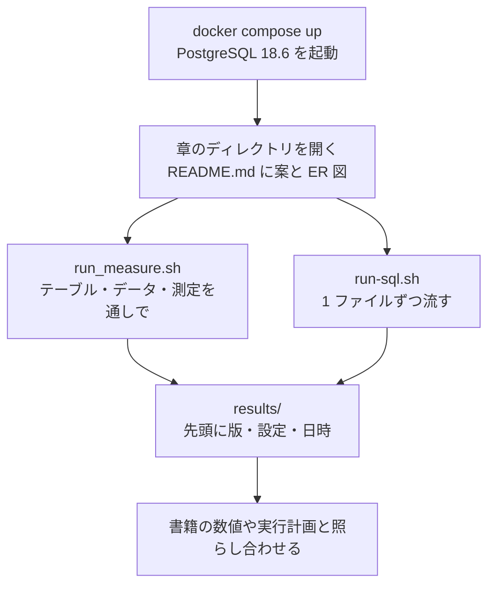

# postgresql-db-design-samples

書籍『PostgreSQLで学ぶDB設計の教科書　Web サービス13題材を動かして比べるデータモデリング』のサンプルです。
題材ごとに設計案を複数用意し、同じデータ量と同じ測り方で比べるための SQL とスクリプトを収めています。

本リポジトリは学習用です。利用にあたっては [DISCLAIMER.md](DISCLAIMER.md) をお読みください。
PostgreSQL プロジェクトとは無関係の、非公式なものです。

## 必要なもの

- Docker（Docker Desktop など。`docker compose` が使えること）
- ほかには何も要りません。`psql` と `pgbench` はコンテナの中のものを使います

クラウドのサービスは使わず、手元のマシンだけで完結します。利用料金は発生しません。

## 動かし方

```bash
docker compose up -d --wait      # PostgreSQL 18.6 を起動する（初回はイメージを取得する）
bash scripts/collect-env.sh      # 版と主な設定値を確かめる
```

`PostgreSQL 18.6` と表示されれば準備は完了です。
各章の手順は、章のディレクトリにある `README.md` に書いてあります。

```bash
# 例: 第6章の案C のテーブルを作り、重なっている予約の組を数える（0 であること）
bash scripts/run-sql.sh book_owner ch06_c ch06_reservation/c_without_overlaps/schema.sql
bash scripts/run-sql.sh book_owner ch06_c ch06_reservation/c_without_overlaps/verify.sql

# 章の測定を最初から通しで流し、results/ に保存する
bash ch06_reservation/run_measure.sh
```

実行の流れは次のとおりです。



片付けるときは次のとおりです。

```bash
bash scripts/reset-chapter.sh 06   # 第6章のスキーマだけを消す
docker compose down                # 止める（データは残る）
docker compose down -v             # データごと消す
```

## 版を 18.6 に固定している理由

`docker-compose.yml` のイメージは `postgres:18.6` と、マイナー版まで書いています。
`postgres:18` のようなタグは取得した時期で中身が変わり、実際に 18.4 が入っていた例がありました。
書籍に載せた実行計画と測定値は 18.6 で取得したものなので、同じ版で動かしてください。

測定値そのもの（処理量や実行時間）は、マシンによって変わります。
書籍の主張は数値の大きさではなく、案どうしの比と実行計画の形に置いています。

## ロール

- `book_admin`: 初期化だけに使うスーパーユーザー。測定には使いません
- `book_owner`: スキーマとテーブルの所有者。テーブルの作成とデータの投入に使います
- `book_app`: 測定に使います。`book_owner` が作ったテーブルを読み書きできます
- `book_guest`: 何の権限も持ちません。権限の章で、`GRANT` した分だけが効くことを確かめるために使います

スーパーユーザーは行レベルセキュリティを迂回するため、`book_admin` で測ると結果を読み誤ります。
パスワードはロール名と同じで、ローカルの学習用です。ポートは `127.0.0.1` にだけ開いています。

## 章ごとのディレクトリとスキーマ

章と案ごとにスキーマを分けています。たとえば第6章の案A は `ch06_a`、案B は `ch06_b` です。
案が違ってもテーブル名を同じにできるので、`search_path` を切り替えるだけで、同じ問い合わせを全部の案に実行できます。
テナントごとにスキーマを分ける案では、案のスキーマ名に続けて `ch13_c_t001` のように名前を付けます。
全章共通のテーブルはありません。章をまたいで使うのは、`lib` スキーマのデータ生成の関数だけです。
`search_path` は「案のスキーマ, public」で、`lib` は入れていません。`lib` の関数は `lib.関数名()` と書いて呼びます。
`scripts/run-sql.sh` は、指定したスキーマがまだ無く、SQL ファイルもそのスキーマを作らないときは、実行せずに止まります。

- [`ch01_environment/`](ch01_environment/) … 第1章 環境をつくり、測り方を決める（スキーマ `ch01`）
- [`ch02_product_catalog/`](ch02_product_catalog/) … 第2章 商品カタログ（`ch02_a` から）
- [`ch03_articles_and_tags/`](ch03_articles_and_tags/) … 第3章 記事とタグ（`ch03_a` から）
- [`ch04_category_and_comment_tree/`](ch04_category_and_comment_tree/) … 第4章 カテゴリとコメントツリー（`ch04_a` から）
- [`ch05_order_and_inventory/`](ch05_order_and_inventory/) … 第5章 注文と在庫の引当（`ch05_a` から）
- [`ch06_reservation/`](ch06_reservation/) … 第6章 予約（`ch06_a` から）
- [`ch07_point_balance/`](ch07_point_balance/) … 第7章 ポイント残高（`ch07_a` から）
- [`ch08_subscription_pricing_and_billing/`](ch08_subscription_pricing_and_billing/) … 第8章 月額課金の料金改定と請求（`ch08_a` から）
- [`ch09_request_and_approval/`](ch09_request_and_approval/) … 第9章 申請と承認（`ch09_a` から）
- [`ch10_notification_and_read_status/`](ch10_notification_and_read_status/) … 第10章 通知と既読（`ch10_a` から）
- [`ch11_sales_dashboard/`](ch11_sales_dashboard/) … 第11章 売上ダッシュボード（`ch11_a` から）
- [`ch12_permission/`](ch12_permission/) … 第12章 権限（`ch12_a` から）
- [`ch13_multi_tenant/`](ch13_multi_tenant/) … 第13章 マルチテナント（`ch13_a` から）
- [`ch14_account_deletion/`](ch14_account_deletion/) … 第14章 退会とデータ削除（`ch14_a` から）
- [`ch15_apply_to_your_own/`](ch15_apply_to_your_own/) … 第15章 自分の題材に当てはめる（`ch15_a` から）

章のディレクトリの中は、次の形にそろえています（章によって、無いものもあります）。

```
<章>/README.md            この章の問い・設計案の構成図・各案の ER 図・動かし方
<章>/run_measure.sh       この章の測定を最初から通しで流し、results/ に保存する
<章>/run_bench.sh         pgbench で同時実行を測る（同時実行を扱う章だけ）
<章>/r_source/            元データ（スキーマ chNN_r）。各案がここから同じ中身を写す
<章>/a_<案の名前>/        案A（スキーマ chNN_a）。schema.sql・load.sql・その案だけの問い合わせ
<章>/b_<案の名前>/        案B（スキーマ chNN_b）
<章>/f_… または x_…/     最初に思いつく案の検算（要件だけを AI に渡して出てきた案）
<章>/queries/             全部の案に同じ意味で流す問い合わせ
<章>/bench/               pgbench のスクリプト
<章>/change/              あとからの変更の手数を測る SQL
<章>/compare/             案をまたいだサイズや一致の確認（ある章だけ）
<章>/results/             採取した出力。先頭に版・設定・日時を記録する
```

ファイル名とファイルの先頭のコメントには、次の決まりがあります（検証スクリプトがこの決まりで実行します）。

- 実行順は `schema` → `load` → その他 → `queries` → `bench` → `verify` → `change`。同じ種類の中はパスの辞書順です。
  順序が要るファイルは `01_` `02_` のように番号で始めます
- わざと失敗させる SQL は、ファイル名を `*_fails.sql` にし、先頭に `-- expect-error: 23P01` のように、
  期待する SQLSTATE かエラー文の一部を書きます。別の理由で失敗したときは、検証が失敗になります
- 既定のロールは、`schema*`・`load`・`change/`・`verify*` が `book_owner`、それ以外が `book_app` です。
  変えるときは、先頭に `-- run-as: book_guest` と書きます
- `verify*.sql` は、返す全部の行の先頭の列が 0 になるように書きます（`SELECT count(*) AS oversold FROM …`）。
  `book_owner` で実行するのは、行レベルセキュリティのあるテーブルでも全部の行を数えるためです

## 隔離の検査

章の SQL が、自分の章のスキーマと `lib` 以外を参照していないかを検査できます。

```bash
bash scripts/check-schema-isolation.sh --self-test   # 検査器そのものの検査
bash scripts/check-schema-isolation.sh
```

## ライセンス

[MIT License](LICENSE)
