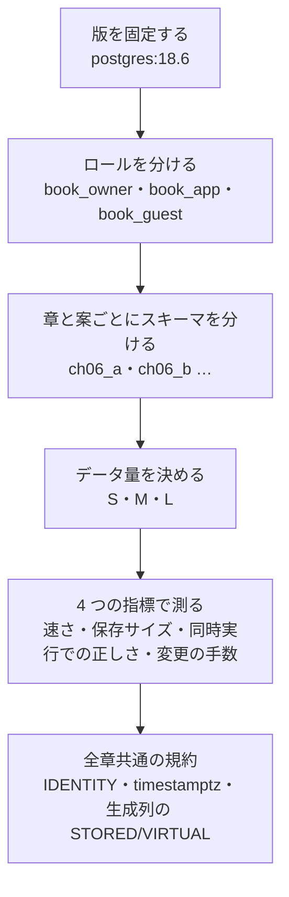
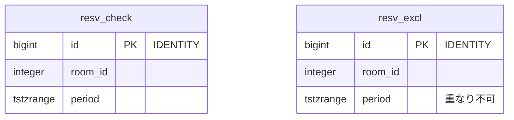
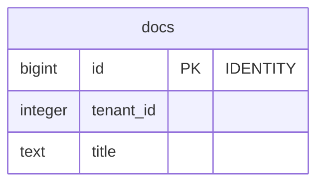
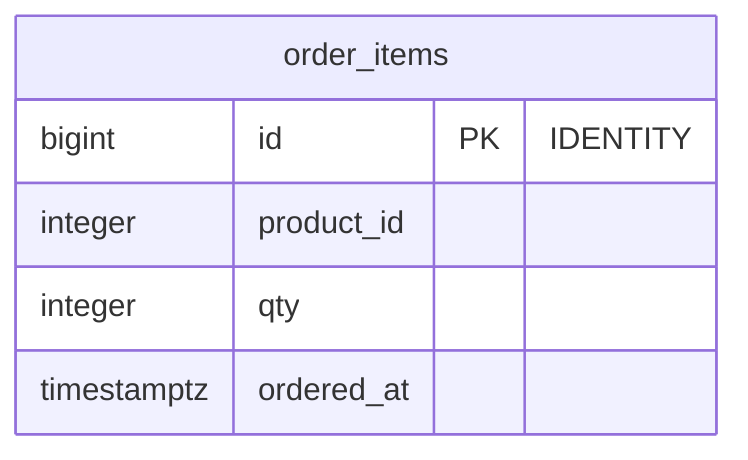
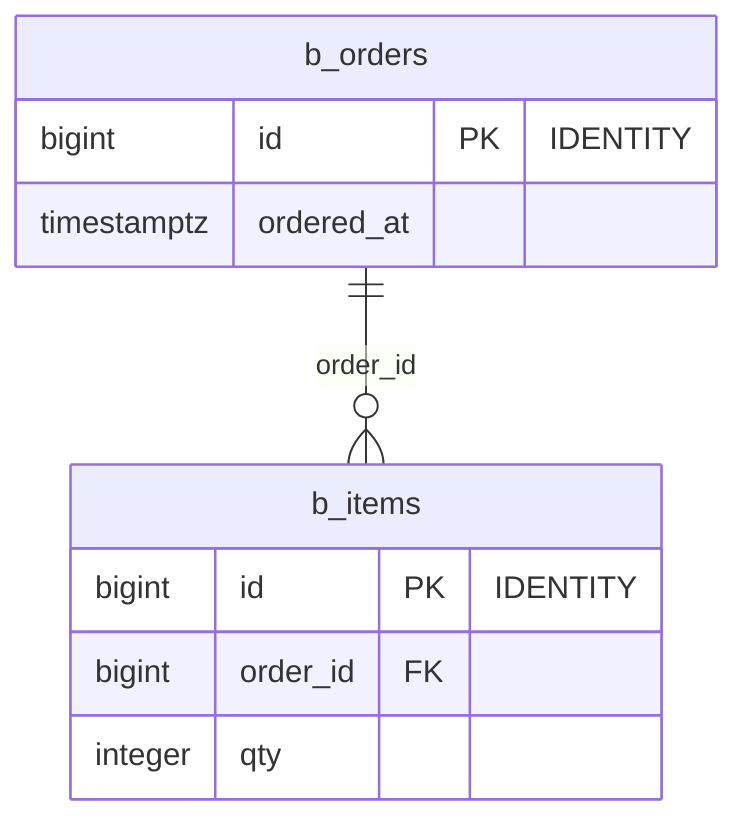
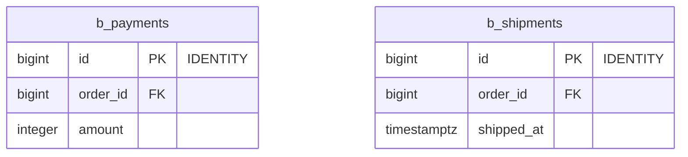

# 第1章 環境をつくり、測り方を決める

書籍『PostgreSQLで学ぶDB設計の教科書』第1章のサンプルです。
この章は案を比べる章ではなく、第2章以降のすべての章で使う **環境と測り方** を 1 回だけ決めます。
スキーマは `ch01` の 1 つだけです。第2章以降は、案ごとに `ch06_a`・`ch06_b` のようにスキーマを分けます。

## この章で決めること



- 冒頭で、予約の 2 つの方式（確認してから登録する方式と、排他制約に任せる方式）を 16 接続で動かし、
  1 接続では見えない誤りが同時実行で出ることを確かめます
- データ量は S（手元で数分）・M（案の差が読み取れる量）・L（`shared_buffers` を超える量）の 3 段です
- 処理量は pgbench を 5 回ずつ流し、中央値と振れ幅を記録します

## この章のテーブル

### 予約の 2 つの方式（冒頭の試作）

<!-- ER:ch01 only=resv_check,resv_excl -->

<!-- /ER -->

### ロールで見える行が変わる例（行レベルセキュリティ）

<!-- ER:ch01 only=docs -->

<!-- /ER -->

### データ量と 4 つの指標の説明に使うテーブル

<!-- ER:ch01 only=order_items -->

<!-- /ER -->

### 主キーの型による保存サイズの比較

`bigint`・UUIDv7・UUIDv4 の 3 組を、同じ形のテーブル 4 つずつで比べます。3 組は主キーの型だけが違うので、ここでは `bigint` の組（`b_`）を描きます。

<!-- ER:ch01 only=b_orders,b_items,b_payments,b_shipments -->
テーブルが多く、1 つの図では字が小さくなるので、2 つの図に分けています。外部キーの参照先が別の図にあるときは、列に FK と付いています。




<!-- /ER -->

## 動かし方

```bash
# 1. テーブルと関数を作る（所有者のロール）
for f in ch01_environment/schema_*.sql; do bash scripts/run-sql.sh book_owner ch01 "$f"; done

# 2. データを入れる（SIZE=S は 10 万行。M は 100 万行、L は 500 万行）
SIZE=S bash scripts/run-sql.sh book_owner ch01 ch01_environment/load_order_items.sql
SIZE=S bash scripts/run-sql.sh book_owner ch01 ch01_environment/load_pk_size.sql

# 3. 測定の結果を results/ に取り直す（M で入れ直して測る。数分かかる）
bash ch01_environment/run_measure.sh
WITH_L=1 bash ch01_environment/run_measure.sh     # L（500 万行）の実行計画も取る
SKIP_BENCH=1 bash ch01_environment/run_measure.sh # pgbench と extras/ を省く

# 4. 予約の 2 つの方式を、同じ条件で 5 回ずつ測る
bash ch01_environment/run_bench.sh > ch01_environment/results/reservation_bench.txt

# 5. やり直すときは、この章のスキーマだけを消す
bash scripts/reset-chapter.sh 01
```

`conv/` は、全章共通の規約（`serial` を使わない理由、UUIDv7、生成列）を確かめる SQL です。
**ファイルごとに実行するロールが違います**。先頭のコメントの `-- run-as:` に書いたロールで流してください
（`04_guest_serial_fails.sql` は `book_guest`）。`*_fails.sql` は失敗するのが正しいファイルです。
`01_serial_manual.sql` を 2 回流すと主キーが衝突するので、やり直すときは手順 5 から始めます。

## ファイル一覧

先頭のコメントの 1 行目を添えています。

<details>
<summary>開く</summary>

<!-- FILES -->
- `load_order_items.sql` … SIZE=S は 10 万行、M は 100 万行、L は 500 万行（L は shared_buffers の 128MB を超える量）
- `load_pk_size.sql` … 親の行数。SIZE=S は 2 万、M は 20 万、L は 100 万。子は親 1 行につき明細 3・支払い 1・出荷 1
- `rls_count_app.sql` … テナント 1 として数える。テナント 1 の行は 2 行
- `rls_count_owner.sql` … テナント 1 として数える。テナント 1 の行は 2 行
- `run_bench.sh` … 予約の 2 つの方式を、同じ条件で 5 回ずつ測る。
- `run_measure.sh` … 第1章の results/ を取り直す。テーブルは schema_*.sql で作成済みであること。
- `schema_10_reservation.sql` … 第1章の最初の節で使う、予約の 2 つの方式。
- `schema_20_rls.sql` … テナントごとに見える行を絞るテーブル。どのロールで数えるかで、結果が変わることを確かめる
- `schema_30_orders.sql` … データ量と 4 つの指標の説明に使う、注文明細のテーブル
- `schema_40_conventions.sql` … 連番の 2 つの書き方を並べる。t_ser は古い書き方（serial）、t_idn は本書の規約（IDENTITY）
- `schema_50_pk_size.sql` … 主キーの型だけが違う、親 1・子 3 のテーブルを 3 組作る。
- `bench/`
  - `book_check.sql`
  - `book_excl.sql`
  - `insert_same_slot_fails.sql` … 関数で包まずに、同じ枠へ INSERT し続ける。2 件目が制約違反になり、クライアントが止まる
- `change/`
  - `01_add_columns.sql` … 変更の手数を 4 点で記録する: 文の数、テーブルの書き換えの有無、取るロック、所要時間。
- `conv/`
  - `01_serial_manual.sql` … serial の列には、値を手で指定して入れられる
  - `02_serial_auto_fails.sql` … 次に値を省いて入れると、シーケンスが 1 を出して主キーが衝突する
  - `03_identity_manual_fails.sql` … GENERATED ALWAYS の列は、値を手で指定した時点で拒否される
  - `04_guest_serial_fails.sql` … INSERT の権限だけでは足りない。serial の裏にあるシーケンスの権限が別に要る
  - `05_guest_identity.sql` … IDENTITY の列は、INSERT の権限だけで入れられる
  - `06_like.sql` … テーブルの定義を写して、新しいテーブルを作る
  - `07_drop_serial_fails.sql` … 写した側が元のシーケンスを使っているので、元のテーブルを消せない
  - `08_uuidv7.sql` … UUIDv7 の値からは、作られた時刻が読める。UUIDv4 からは読めない
  - `09_generated.sql` … 生成列の 3 つの書き方。STORED も VIRTUAL も書かないと、どちらになるか
  - `10_index_virtual_fails.sql`
- `extras/`
  - `dropped_column.sh` … 列を足して消す操作を繰り返すと、テーブルのサイズに影響が残るかを確かめる。
  - `error_order.sh` … SQL の流し方で、ERROR の行の位置が変わるかを数える。
  - `ext_placement.sh` … 拡張を専用のスキーマに置くと何が起きるかを、別のデータベースで確かめる。
  - `index_first.sh` … インデックスを付けたままデータを入れると、サイズがどう変わるかを確かめる。
- `queries/`
  - `01_settings.sql` … 測定値と一緒に残す設定値
  - `10_content_hash.sql` … 生成したデータが毎回同じかを、行数と内容のハッシュで確かめる
  - `11_skew.sql` … 偏りの確認。上位 1% の商品（100 商品）が、注文の何 % を占めるか
  - `20_explain_popular.sql` … 人気の商品（注文が多い）の、直近の注文 20 件
  - `21_explain_rare.sql` … 注文が少ない商品で、同じ問い合わせ
  - `22_explain_index_searches.sql` … 商品を 3 つ指定する。Index Searches が、インデックスを引き直した回数を示す
  - `23_explain_full.sql` … 全件を読む集計。Buffers の shared hit と read を見る
  - `24_explain_estimate.sql` … 見積もりの行数（rows=）と、実際の行数（actual の rows=）を比べる
  - `30_sizes.sql` … 保存サイズ。テーブル本体、インデックス、合計を分けて見る
  - `40_pk_size.sql` … 親子 4 テーブルの合計を、主キーの型ごとに比べる
  - `count_overlaps.sql` … 同じ部屋で時間が重なっている予約の組を数える。0 でなければ約束が破られている
<!-- /FILES -->

</details>

## results/

採取した出力です。先頭に `bash scripts/collect-env.sh` の出力（版・設定・日時）が付いています。
ファイル名の `_S`・`_M`・`_L` は、そのデータ量で取ったことを表します。
