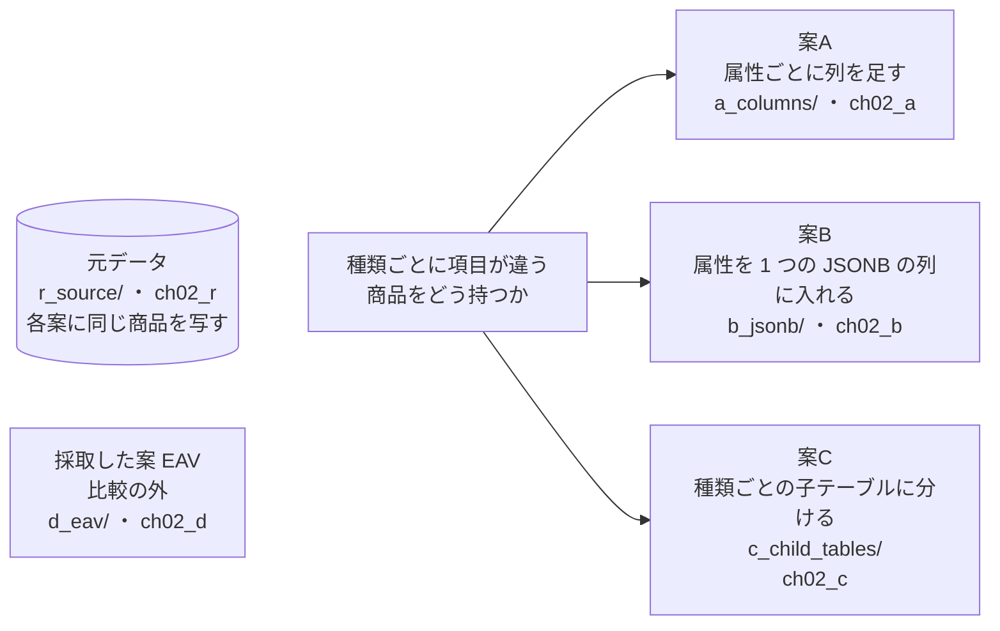
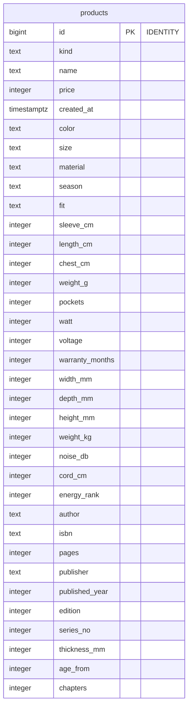
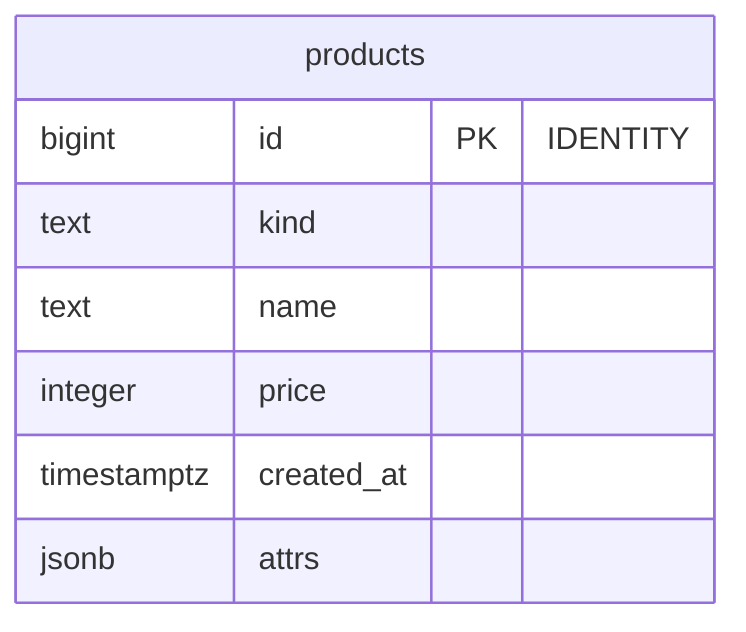
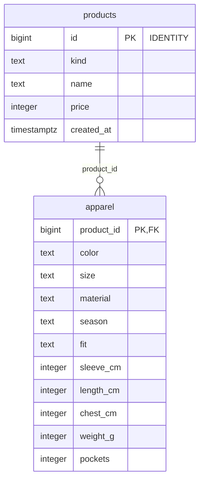
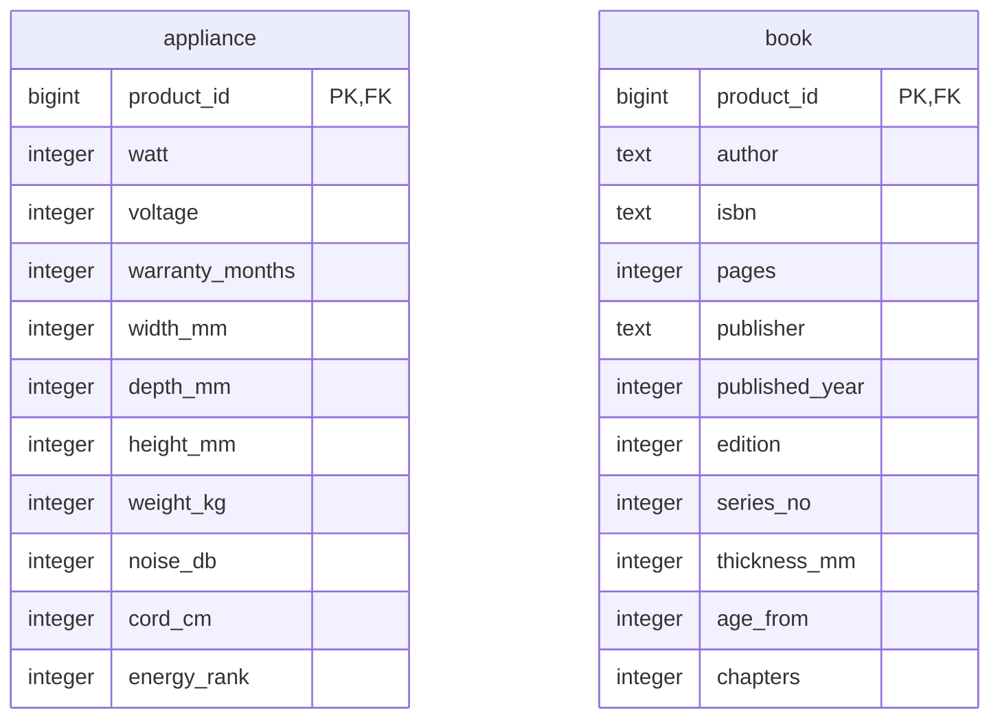
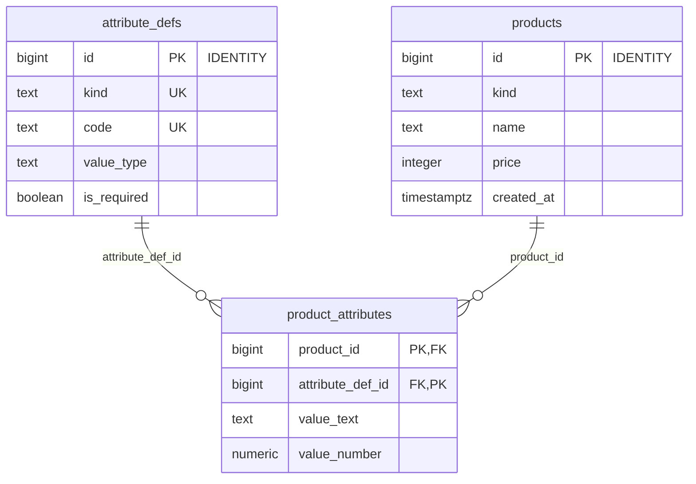

# 第2章 商品カタログ　種類ごとに項目が違う商品をどう持つか

書籍『PostgreSQLで学ぶDB設計の教科書』第2章のサンプルです。

家電・衣料・書籍を扱う EC サイトの商品カタログを、3 つの案で作り、同じ商品を入れて比べます。

## この章で決めること

- 種類ごとに違う属性を、列・JSONB・子テーブルのどれで持つか
- 「属性 2 つで絞り込み、新しい順に 20 件」を、1 つのインデックスで処理できるか

## 設計案の構成図



- どの案でも、商品のテーブルの名前は `products` です。`search_path` を切り替えるだけで、同じ問い合わせを全部の案に流せます
- 元データは `r_source/`（`ch02_r`）で 1 回だけ作り、各案が id の順に写します
- `d_eav/`（「商品・属性・値」の 3 つ組で持つ形）は、要件だけを AI に渡して出てきた案です。S だけで測り、3 案の比較からは外しています

## 各案のテーブル

### 案A 属性ごとに列を足す（`ch02_a`）

<!-- ER:ch02_a -->

<!-- /ER -->

### 案B 属性を 1 つの JSONB の列に入れる（`ch02_b`）

<!-- ER:ch02_b -->

<!-- /ER -->

### 案C 種類ごとの子テーブルに分ける（`ch02_c`）

<!-- ER:ch02_c -->
テーブルが多く、1 つの図では字が小さくなるので、2 つの図に分けています。外部キーの参照先が別の図にあるときは、列に FK と付いています。




<!-- /ER -->

### 採取した案 EAV（`ch02_d`、比較の外）

<!-- ER:ch02_d -->

<!-- /ER -->

## 動かし方

```bash
# 全部を取り直す（既定は M = 100 万商品。手元で試すなら S = 10 万商品）
SIZE=S bash ch02_product_catalog/run_measure.sh

# 1 つずつ流すとき
bash scripts/reset-chapter.sh 02
bash scripts/run-sql.sh book_owner ch02_r ch02_product_catalog/r_source/schema_10_table.sql
SIZE=S bash scripts/run-sql.sh book_owner ch02_r ch02_product_catalog/r_source/schema_20_generate.sql
bash scripts/run-sql.sh book_owner ch02_a ch02_product_catalog/a_columns/schema.sql
bash scripts/run-sql.sh book_owner ch02_a ch02_product_catalog/a_columns/load.sql
bash scripts/run-sql.sh book_app   ch02_a ch02_product_catalog/a_columns/queries/10_popular.sql
```

- 先頭のコメントに `-- run-as: book_owner` とあるファイルは `book_owner` で流します（統計やインデックスを足して `ROLLBACK` で戻すファイル）
- `change/` はテーブルを書き換えます。流したあとで測定を続けるときは、その案の `load.sql` を流し直します
- `*_fails.sql` は失敗するのが正しいファイルです

## どの案を選ぶか（書籍の「条件ごとの選び方」の要点）

- 絞り込みと並べ替えを組み合わせる属性は、案A の列にする（1 つのインデックスに入れられるのは、同じテーブルの列だけ）
- 運営が画面から足し、表示するだけの属性は、案B が向いている
- 種類ごとに業務のルールが大きく違うなら、案C の子テーブルが業務の単位と一致する
- 絞り込みに使う少数の属性を列にし、表示するだけの属性を JSONB に入れる混ぜ方もある

## ファイル一覧

先頭のコメントの 1 行目を添えています。

<details>
<summary>開く</summary>

<!-- FILES -->
- `run_measure.sh` … 第2章の results/ を取り直す。スキーマを消して作り直すところから始める。
- `a_columns/`
  - `load.sql` … 元データ（ch02_r.src）を id の順に写す。先に r_source/ の 2 つのファイルを実行しておく元データが空のまま写すと、空のテーブルで測ることになる。何も消す前に止める
  - `schema.sql` … 案A: 属性ごとに列を足す。種類に関係のない列は NULL になる
  - `verify_content.sql` … 検査: 案A の中身が元データと同じであること。どの行も、先頭の列が 0 なら合格
  - `a_columns/change/`
    - `01_add_attribute.sql` … 変更の手数（案A）: 属性「原産国」を足す → 必須にする → 絞り込めるようにする。
    - `10_wal_update.sql` … 属性を 1 つだけ更新したときに書かれる WAL（変更の記録）の量。衣料の先頭 1,000 商品の素材を変える。
  - `a_columns/queries/`
    - `10_popular.sql` … よく出る値（色が black でサイズが M）の衣料を、新しい順に 20 件
    - `11_middle.sql` … 中くらいの頻度の値（色が yellow でサイズが XL）の衣料を、新しい順に 20 件
    - `12_rare.sql` … 珍しい値（色が teal でサイズが XXS）の衣料を、新しい順に 20 件
    - `20_estimate.sql` … 見積もりの行数（rows=）と実際の行数（actual rows=）を比べる。LIMIT を付けずに、条件に合う商品を全部取る
    - `25_estimate_stability.sql` … 見積もりは、ANALYZE がテーブルから抜き取る標本で決まる。標本は毎回変わるので、 ANALYZE を 5 回繰り返し、3 つの条件の見積もりと、中くらいの頻度の値の実行計画の形を記録する。
    - `30_extended_statistics.sql` … 色とサイズは「衣料のときだけ両方に値が入る」ので、独立ではない。
- `b_jsonb/`
  - `load.sql` … 元データ（ch02_r.src）を id の順に写す。先に r_source/ の 2 つのファイルを実行しておく元データが空のまま写すと、空のテーブルで測ることになる。何も消す前に止める
  - `schema.sql` … 案B: 種類ごとの属性を 1 つの jsonb の列に入れる
  - `verify_content.sql` … 検査: 案B の中身が元データと同じであること。どの行も、先頭の列が 0 なら合格
  - `b_jsonb/change/`
    - `01_add_attribute.sql` … 変更の手数（案B）: 属性「原産国」を足す → 必須にする → 絞り込めるようにする。
    - `02_extract_to_column.sql` … あとで変えるのが大変な点: jsonb に入れた属性（color）を、通常の列へ取り出す。
    - `10_wal_update.sql` … 属性を 1 つだけ更新したときに書かれる WAL（変更の記録）の量。衣料の先頭 1,000 商品の素材を変える。
  - `b_jsonb/gen/`
    - `01_virtual_index_fails.sql` … 17 以前の記事の書き方から STORED を省いて写した場合。18 では、書かなければ VIRTUAL の生成列になる。
    - `02_virtual_with_expression_index.sql` … VIRTUAL の生成列にはインデックスを付けられないが、同じ式の式インデックスは使われる。
    - `03_stored.sql` … STORED の生成列は値をテーブルに保存するので、インデックスも統計も普通の列と同じに使える。
    - `10_insert_array_fails.sql` … attrs に配列を入れようとすると、CHECK (attrs IS JSON OBJECT) が断る
    - `11_insert_missing_key_fails.sql` … 衣料なのに size が無い
    - `12_insert_wrong_type_fails.sql` … 数値の属性に文字列が入っている
    - `20_json_value.sql` … 値を型つきで取り出す。-> は jsonb、->> は text、JSON_VALUE は RETURNING で指定した型を返す
    - `21_json_value_error_fails.sql`
  - `b_jsonb/queries/`
    - `10_popular.sql` … よく出る値（色が black でサイズが M）の衣料を、新しい順に 20 件。@>（含む）で書く
    - `11_middle.sql` … 中くらいの頻度の値（色が yellow でサイズが XL）の衣料を、新しい順に 20 件。@>（含む）で書く
    - `12_rare.sql` … 珍しい値（色が teal でサイズが XXS）の衣料を、新しい順に 20 件。@>（含む）で書く
    - `13_popular_arrow.sql` … 同じ条件を ->>（キーの値を文字列で取り出す）で書く。GIN インデックスは使われない
    - `14_rare_arrow.sql` … 珍しい値を ->> で書く
    - `15_middle_both_plans.sql` … 案B の「中くらいの頻度の値を、新しい順に 20 件」には、実行計画の候補が 2 つある。
    - `20_estimate.sql` … 見積もりの行数（rows=）と実際の行数（actual rows=）を比べる。LIMIT を付けずに、条件に合う商品を全部取る
    - `21_estimate_arrow.sql` … 同じ 3 つの条件を ->> で書いたときの見積もり
    - `25_estimate_stability.sql` … 見積もりは、ANALYZE がテーブルから抜き取る標本で決まる。標本は毎回変わるので、 ANALYZE を 5 回繰り返し、3 つの条件の見積もりと、中くらいの頻度の値の実行計画の形を記録する。
    - `30_extended_statistics.sql` … ->> で取り出した値には統計が無い。式を対象にした拡張統計を足すと、見積もりと、選ばれる実行計画がどう変わるかを見る。インデックスは足さない。
    - `40_gin_sizes.sql` … GIN インデックスの 2 つの種類（演算子クラス）で、サイズと、使える検索を比べる
- `c_child_tables/`
  - `first_idea_check_subquery_fails.sql` … 採取した案の 1 つは、子テーブルの CHECK で親の種類を問い合わせていた。
  - `load.sql` … 元データ（ch02_r.src）を id の順に写す。先に r_source/ の 2 つのファイルを実行しておく元データが空のまま写すと、空のテーブルで測ることになる。何も消す前に止める
  - `schema.sql` … 案C: 共通の項目を親テーブルに、種類ごとの属性を子テーブルに分ける。
  - `verify_content.sql` … 検査: 案C の中身が元データと同じであること。どの行も、先頭の列が 0 なら合格
  - `c_child_tables/change/`
    - `01_add_attribute.sql` … 変更の手数（案C）: 衣料に属性「原産国」を足す → 必須にする → 絞り込めるようにする。
    - `10_wal_update.sql` … 属性を 1 つだけ更新したときに書かれる WAL（変更の記録）の量。衣料の先頭 1,000 商品の素材を変える。
  - `c_child_tables/queries/`
    - `10_popular.sql` … よく出る値（色が black でサイズが M）の衣料を、新しい順に 20 件
    - `11_middle.sql` … 中くらいの頻度の値（色が yellow でサイズが XL）の衣料を、新しい順に 20 件
    - `12_rare.sql` … 珍しい値（色が teal でサイズが XXS）の衣料を、新しい順に 20 件
    - `20_estimate.sql` … 見積もりの行数（rows=）と実際の行数（actual rows=）を比べる。LIMIT を付けずに、条件に合う商品を全部取る
    - `25_estimate_stability.sql` … 見積もりは、ANALYZE がテーブルから抜き取る標本で決まる。標本は毎回変わるので、 ANALYZE を 5 回繰り返し、3 つの条件の見積もりと、中くらいの頻度の値の実行計画の形を記録する。
    - `40_copy_created_at.sql` … 案C で「絞り込んで新しい順に 20 件」を 1 つのインデックスで処理するには、並べ替えに使う created_at を子テーブルにも持たせる必要がある。
- `d_eav/`
  - `load.sql` … 元データ（ch02_r.src）を id の順に写す。先に r_source/ の 2 つのファイルを実行しておく元データが空のまま写すと、空のテーブルで測ることになる。何も消す前に止める
  - `schema.sql` … 参考の案D: 属性を「商品・属性・値」の 3 つ組で縦に持つ（EAV）。
  - `verify_content.sql` … 検査: 案D の中身が元データと同じであること。どの行も、先頭の列が 0 なら合格
  - `d_eav/queries/`
    - `10_popular.sql` … よく出る値（色が black でサイズが M）の衣料を、新しい順に 20 件（採取した案の問い合わせのまま）
    - `11_middle.sql` … 中くらいの頻度の値（色が yellow でサイズが XL）の衣料を、新しい順に 20 件（採取した案の問い合わせのまま）
    - `12_rare.sql` … 珍しい値（色が teal でサイズが XXS）の衣料を、新しい順に 20 件（採取した案の問い合わせのまま）
    - `20_estimate.sql` … 見積もりの行数（rows=）と実際の行数（actual rows=）を比べる。LIMIT を付けずに、条件に合う商品を全部取る
- `queries/`
  - `90_sizes.sql` … 保存サイズ。いま search_path の先頭にあるスキーマのテーブルを全部並べる
- `r_source/`
  - `schema_10_table.sql` … 元データ。ここで 1 回だけ作り、各案の load.sql が id の順に写す。
  - `schema_20_generate.sql` … 元データを作る。各案の load.sql より先に実行する。
  - `r_source/queries/`
    - `10_content.sql` … 元データの内容を確かめる。content_hash は、同じ SIZE なら何度作り直しても同じ値になる
<!-- /FILES -->

</details>

## results/

採取した出力です。先頭に `bash scripts/collect-env.sh` の出力（版・設定・日時）が付いています。
ファイル名の `_S`・`_M` は、そのデータ量で取ったことを表します。書籍の図と数値は M です。
