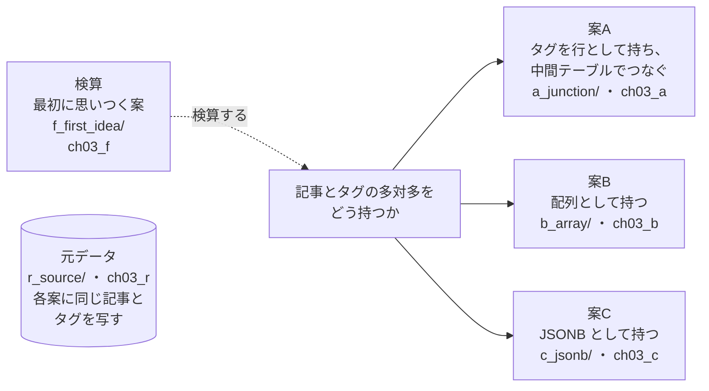
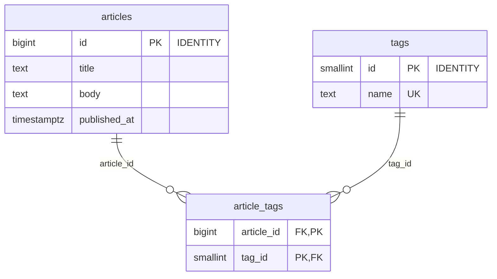
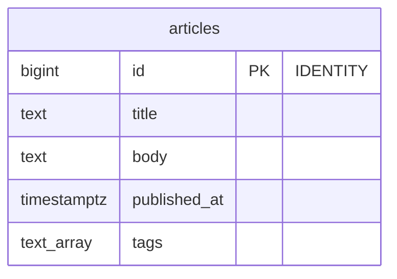
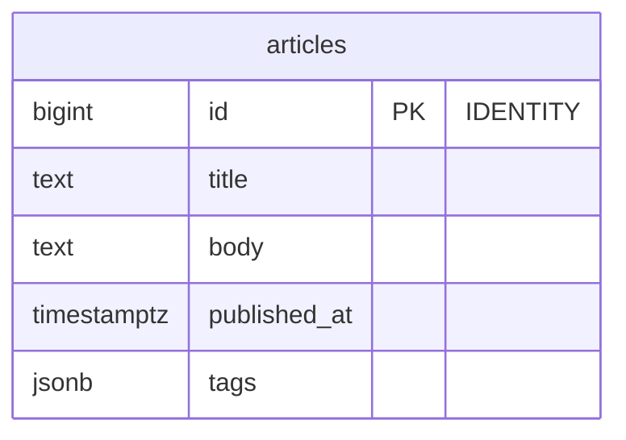

# 第3章 記事とタグ　多対多を中間テーブル・配列・JSONB で比べる

書籍『PostgreSQLで学ぶDB設計の教科書』第3章のサンプルです。

ブログの記事にタグを付ける多対多を、3 つの案で作り、同じ記事とタグを入れて比べます。

## この章で決めること

- タグを別テーブルの行として持つか、記事の中に配列か JSONB で持つか
- 人気のタグでも珍しいタグでも、記事の一覧が速く返るか
- 同じ結果を返す 2 つの書き方で、実行計画がどこまで変わるか

## 設計案の構成図



- `f_first_idea/` は、要件だけを AI に渡して出てきた案を動かし、どこで要件を満たさないかを確かめるためのものです

## 各案のテーブル

### 案A タグを行として持ち、中間テーブルでつなぐ（`ch03_a`）

<!-- ER:ch03_a -->

<!-- /ER -->

### 案B 配列として持つ（`ch03_b`）

<!-- ER:ch03_b -->

<!-- /ER -->

### 案C JSONB として持つ（`ch03_c`）

<!-- ER:ch03_c -->

<!-- /ER -->

### 検算: 最初に思いつく案（`ch03_f`）

<!-- ER:ch03_f -->

<!-- /ER -->

## 動かし方

```bash
# 手元で試すなら S（10 万記事）。数分で終わる
SIZE=S bash ch03_articles_and_tags/run_measure.sh

# 書籍の図と数値は L（1,000 万記事）。元データの生成に約 6 分、3 案の投入に約 5 分、ディスクを約 6GB 使う
bash ch03_articles_and_tags/run_measure.sh

# やり直すときは、この章のスキーマだけを消す
bash scripts/reset-chapter.sh 03
```

- `*_fails.sql` は失敗するのが正しいファイルです（配列の要素に外部キーは張れない、など）
- `change/` はテーブルを書き換えます（タグの改名・統合、配列から中間テーブルへの移行）

## どの案を選ぶか（書籍の「条件ごとの選び方」の要点）

- タグに属性（色・説明など）を持たせる予定がある、タグの名前を変える運用がある、タグごとの集計を頻繁に行う、のどれかなら案A
- タグが単なるラベルで、検索が主で、サイズを抑えたいなら案B
- ほかにも JSON で持ちたい属性があり、1 つの列にまとめたいなら案C（見積もりが振れることを前提に、遅い計画が出たときの調べ方を用意しておく）

## ファイル一覧

先頭のコメントの 1 行目を添えています。

<details>
<summary>開く</summary>

<!-- FILES -->
- `run_measure.sh` … 第3章の results/ を取り直す。スキーマを消して作り直すところから始める。
- `a_junction/`
  - `20_check_with_subquery_fails.sql` … 案A では「1 記事のタグは 5 個まで」を CHECK で書けない。
  - `load.sql` … 元データを写す。インデックスはデータを入れてから作る（充填率を一定にするため）
  - `schema.sql` … 案A: タグを行として持ち、記事とタグを中間テーブルでつなぐ
  - `verify_content.sql` … 元データと同じ中身が入っているか（全行の先頭列が 0 になること）
  - `a_junction/change/`
    - `10_rename.sql` … 変更シナリオ 1: タグの名前を変える（tag001 を postgres に）。
    - `11_merge.sql` … 変更シナリオ 2: タグを統合する（tag002 を tag001 にまとめる）。
  - `a_junction/constraints/`
    - `10_unique_is_case_sensitive.sql` … 通常の UNIQUE では、大文字小文字だけが違うタグが別の行として入る
    - `11_nondeterministic_collation.sql` … 方法 1: 大文字小文字を区別しない照合順序を作り、その照合順序で一意制約を張る
    - `12_nondeterministic_collation_fails.sql` … 同じ表記ゆれは、2 件目の時点で一意制約に弾かれる
    - `13_lower_expression_index.sql` … 方法 2: 式の一意インデックス。照合順序を変えずに済むが、問い合わせ側も lower() で書かないとインデックスが効かない
    - `14_lower_expression_index_fails.sql`
  - `a_junction/queries/`
    - `10_popular_by_name.sql` … 人気タグ（tag001）の記事を新しい順に 20 件。タグ名で結合する 1 文で書く
    - `11_middle_by_name.sql` … 中くらいのタグ（tag050）。10 と同じ書き方
    - `12_rare_by_name.sql` … 珍しいタグ（tag150）。10・11 と同じ書き方。ここで計画の問題が表面化する
    - `13_rare_by_id.sql` … 珍しいタグ（tag150）を、タグの id を先に引いてから記事を引く形で書く。
    - `14_and_by_name.sql` … よく使われるタグ 2 つの AND 検索。タグ名で結合する書き方
    - `15_and_by_id.sql` … 同じ AND 検索を、タグの id を定数として渡す形で書く
    - `16_not.sql` … tag100 が付いていて tag101 が付いていない記事
    - `17_counts.sql` … タグごとの記事数（多い順 20 件）
- `b_array/`
  - `21_array_fk_fails.sql` … 案B では、配列の要素にタグのマスタへの外部キーを張れない
  - `load.sql`
  - `schema.sql` … 案B: タグを記事の列に text の配列として持つ
  - `verify_content.sql` … 元データと同じ中身か（全行の先頭列が 0）
  - `b_array/change/`
    - `10_rename.sql` … 案B では、そのタグを持つ記事すべての配列を書き換える
    - `11_merge.sql` … 案B の統合。置き換えたあと、同じタグが 2 つ並ぶ記事を整理する
    - `20_to_junction.sql` … あとで変えるのが大変な点: 案B から案A の形へ移す。
  - `b_array/queries/`
    - `10_popular.sql` … 人気タグ（tag001）の記事を新しい順に 20 件
    - `11_middle.sql` … 中くらいのタグ（tag050）
    - `12_rare.sql` … 珍しいタグ（tag150）
    - `14_and.sql` … よく使われるタグ 2 つの AND 検索。@> の右辺に 2 つ並べる 1 文で書ける
    - `16_not.sql` … tag100 が付いていて tag101 が付いていない記事
    - `17_counts.sql` … タグごとの記事数（多い順 20 件）。配列を行に展開して数える
    - `25_estimate_stability.sql` … ANALYZE のたびに見積もりが変わるかを 5 回見る（問い合わせは実行しない）
    - `91_gin_build.sql` … GIN の作成時間。並列作成の効果を見る
- `c_jsonb/`
  - `load.sql`
  - `schema.sql` … 案C: タグを記事の列に jsonb の配列として持つ
  - `verify_content.sql`
  - `c_jsonb/change/`
    - `10_rename.sql` … 案C の名前の変更。案B と同じく、持っている記事すべてを書き換える
  - `c_jsonb/queries/`
    - `10_popular.sql` … 人気タグ（tag001）の記事を新しい順に 20 件
    - `11_middle.sql` … 中くらいのタグ（tag050）
    - `12_rare.sql` … 珍しいタグ（tag150）
    - `14_and.sql` … よく使われるタグ 2 つの AND 検索。@> の右辺に 2 つ並べる 1 文で書ける
    - `16_not.sql` … tag100 が付いていて tag101 が付いていない記事
    - `17_counts.sql` … タグごとの記事数（多い順 20 件）。配列を行に展開して数える
    - `25_estimate_stability.sql` … ANALYZE のたびに見積もりが変わるかを 5 回見る（問い合わせは実行しない）
    - `91_gin_build.sql` … GIN の作成時間。並列作成の効果を見る
- `f_first_idea/`
  - `load.sql`
  - `schema.sql` … 「最初に思いつく案」の検算用。採取した案（haiku）のとおりに作る。
  - `f_first_idea/queries/`
    - `10_popular.sql` … 採取した案の問い合わせ 1。人気タグ（tag001）なら速い
    - `12_rare.sql` … 同じ問い合わせを珍しいタグ（tag150）で。ここで計画が変わる
    - `14_and.sql` … 採取した案の問い合わせ 2。珍しいタグ 2 つの AND 検索
    - `20_skip_scan.sql` … 主キー (article_id, tag_id) だけでタグから記事を引けるかを見る。
- `queries/`
  - `90_sizes.sql` … 案ごとの保存サイズ。本体とインデックスを分けて出す
- `r_source/`
  - `schema_10_table.sql` … 第3章の元データ。3 案がここから同じ中身を写す（案ごとに作り直さない）。
  - `schema_20_generate.sql` … 元データを作る。各案の load.sql より先に実行する。
  - `r_source/queries/`
    - `10_content.sql` … 元データの中身を確かめる（偏りが入っているか）
<!-- /FILES -->

</details>

## results/

採取した出力です。先頭に `bash scripts/collect-env.sh` の出力（版・設定・日時）が付いています。
ファイル名の `_S`・`_L` は、そのデータ量で取ったことを表します。書籍の図と数値は L です。
