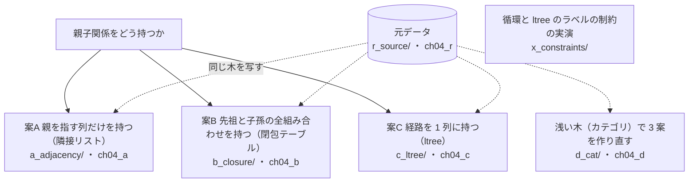
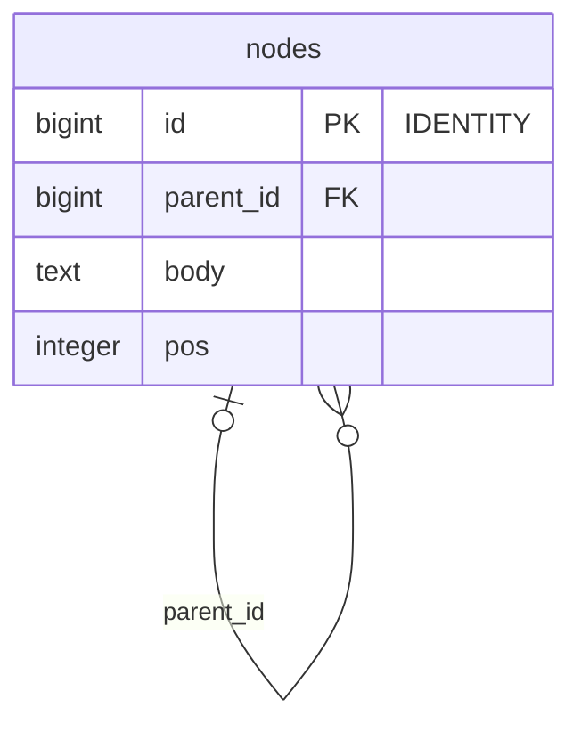
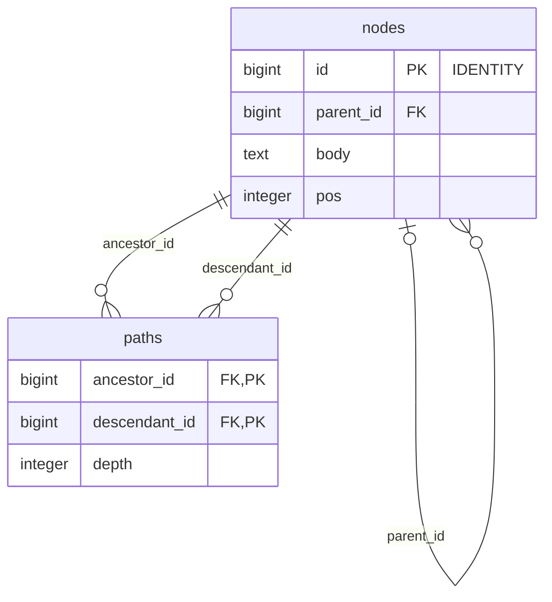
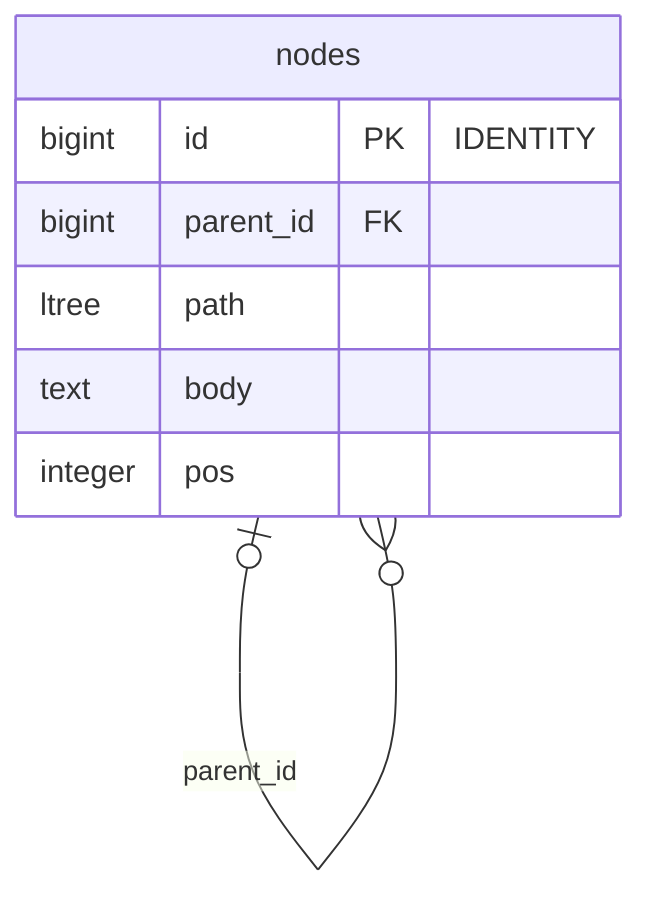

# 第4章 カテゴリとコメントツリー　親子関係をどう持つか

書籍『PostgreSQLで学ぶDB設計の教科書』第4章のサンプルです。

商品のカテゴリ（浅い木）と、掲示板のコメントのスレッド（深い木）を、3 つの案で作って比べます。

## この章で決めること

- 木を、親を指す列（隣接リスト）・先祖と子孫の組み合わせ（閉包テーブル）・経路の列（`ltree`）のどれで持つか
- 配下すべての取得・パンくず・直下の子・部分木の移動の、どれが速いか
- 親子の循環を制約で防げるか
- 浅い木と深い木で、結論が変わるか

## 案の見取り図



- 3 案の比較はコメントのスレッド（深い木）で行い、`d_cat/` でカテゴリ（浅い木）について同じ比較をやり直します

## 各案のテーブル

### 案A 親を指す列だけを持つ（`ch04_a`）

<!-- ER:ch04_a -->

<!-- /ER -->

### 案B 先祖と子孫の全組み合わせを持つ（`ch04_b`）

<!-- ER:ch04_b -->

<!-- /ER -->

### 案C 経路を 1 列に持つ（`ch04_c`）

<!-- ER:ch04_c -->

<!-- /ER -->

## 動かし方

```bash
# 手元で試すなら S。書籍の図と数値は M（100 万ノード。投入に約 2 分）
SIZE=S bash ch04_category_and_comment_tree/run_measure.sh
bash ch04_category_and_comment_tree/run_measure.sh

# やり直すときは、この章のスキーマだけを消す
bash scripts/reset-chapter.sh 04
```

- `change/` と各案の `change/` は、部分木の移動などでテーブルを書き換えます
- `a_adjacency/verify.sql` は循環を数える定期検査です（0 であること）。`a_adjacency/change/` には、わざと輪を作って検査が働くことを確かめる SQL があります
- `*_fails.sql` は失敗するのが正しいファイルです

## どの案を選ぶか（書籍の「条件ごとの選び方」の要点）

- 木が浅い（5 階層まで）なら、案A で十分
- 木が深く、子孫の一括取得が主で、移動がほとんど無いなら案B（サイズが大きくなり、移動が遅くなる代わりに子孫の取得が速い）
- 木が深く、サイズを抑えたいなら案C
- 移動が頻繁なら、深さに関係なく案A

## ファイル一覧

先頭のコメントの 1 行目を添えています。

<details>
<summary>開く</summary>

<!-- FILES -->
- `change_move_summary.sql` … 3 案の「部分木の移動」を続けて測り、1 つのログにまとめる。
- `run_measure.sh` … 第4章の results/ を取り直す。スキーマを消して作り直すところから始める。
- `a_adjacency/`
  - `load.sql` … 元データを写す。インデックスはデータを入れてから作る（充填率を一定にするため）
  - `schema.sql` … 案A: 親を指す列だけを持つ（隣接リスト）
  - `verify.sql` … 制約で防げない以上、定期的に検査する。全行の先頭列が 0 になること。
  - `verify_content.sql` … 元データと同じ木が入っているか（全行の先頭列が 0 になること）
  - `a_adjacency/change/`
    - `10_move_subtree.sql` … ノード 11 の部分木（子孫 84,700 件）を、別の親（ノード 3）へ移す。
    - `20_cycle_canary.sql` … 検査そのものを検査する。わざと輪を作り、検査が 0 以外を返すことを確かめる。
    - `30_add_path_column.sql` … 案A で運用を始めたあとに、経路の列（案C の形）を足す手順と時間。
  - `a_adjacency/queries/`
    - `10_descendants.sql` … 子孫すべての件数。親を指す列しかないので、段ごとにインデックスを引き直す
    - `11_ancestors.sql` … 先祖すべて（パンくず）。深さのぶんしか辿らない
    - `12_children.sql` … 直下の子だけ。親を指す列のインデックスをそのまま引く
    - `20_cycle_check_timed.sql` … verify.sql と同じ検査を、所要時間つきで測る。
- `b_closure/`
  - `load.sql` … 元データを写し、閉包（先祖と子孫のすべての対）を組み立てる
  - `schema.sql` … 案B: 先祖と子孫の全組み合わせを別の表に持つ（閉包テーブル）
  - `verify_content.sql` … 元データと同じ木が入っているか、閉包が正しいか（全行の先頭列が 0 になること）
  - `b_closure/change/`
    - `10_move_subtree.sql` … ノード 11 の部分木を、別の親（ノード 3）へ移す。
  - `b_closure/queries/`
    - `10_descendants.sql` … 子孫すべての件数。主キーの前方一致 1 回で済む
    - `11_ancestors.sql` … 先祖すべて（パンくず）。逆向きのインデックスを引く
    - `12_children.sql` … 直下の子だけ。depth = 1 の部分インデックスを引く。
    - `13_children_no_partial.sql` … 直下の子を、depth = 1 の部分インデックスが無い状態で引く（比較用）。
- `c_ltree/`
  - `load.sql` … 元データを写す。path は NOT NULL なので、経路を組み立てながら 1 文で入れる（先に行だけ入れてあとで経路を埋める 2 段構えにすると、最初の INSERT が
  - `schema.sql` … 案C: ルートから自分までの経路を 1 列に持つ（ltree）
  - `verify_content.sql` … 元データと同じ木が入っているか、経路が正しいか（全行の先頭列が 0 になること）
  - `c_ltree/change/`
    - `10_move_subtree.sql` … ノード 11 の部分木を、別の親（ノード 3）へ移す。
  - `c_ltree/queries/`
    - `10_descendants.sql` … 子孫すべての件数。経路の前方一致を GiST で引く
    - `11_ancestors.sql` … 先祖すべて（パンくず）。自分の経路に含まれる id をそのまま読む
    - `12_children.sql` … 直下の子だけ。経路ではなく親を指す列で引く（経路のインデックスより速い）
    - `20_path_order.sql` … 経路は文字列として辞書順に比較される。ラベルに id を入れると、投稿順にはならない。
    - `21_path_order_rows.sql` … 上の並びを実際に見る（先頭 6 件）
- `d_cat/`
  - `load.sql`
  - `schema.sql` … カテゴリ型（深さ 5）で 3 案を作り、スレッド型と結論が変わるかを見る。
  - `d_cat/change/`
    - `10_move_summary.sql` … カテゴリ型（深さ 5）で、3 案の「部分木の移動」を続けて測る。
  - `d_cat/queries/`
    - `10_descendants.sql` … カテゴリ型（深さ 5）で、3 案の子孫取得を測る
    - `11_descendants_b.sql`
    - `12_descendants_c.sql`
- `queries/`
  - `90_sizes.sql` … 案ごとの保存サイズ。本体とインデックスを分けて出す
- `r_source/`
  - `schema_10_table.sql` … 第4章の元データ。3 案がここから同じ木を写す（案ごとに作り直さない）。
  - `schema_20_generate.sql` … 元データを作る。各案の load.sql より先に実行する。
  - `r_source/queries/`
    - `10_content.sql` … 元データの中身。案を作り直しても同じ木であることを、この出力で確かめる。
- `x_constraints/`
  - `10_fk_allows_cycle.sql` … 自己参照の外部キーは、循環を拒否しない。
  - `20_check_blocks_self_loop.sql` … 自分自身を親にすることだけは CHECK で防げる（他の行を見ないため）
  - `30_self_loop_fails.sql` … 自己ループは CHECK に弾かれる
  - `40_cycle_still_passes.sql` … 2 ノード以上の輪は CHECK では防げない（副問い合わせを書けないため）。
  - `50_ltree_labels.sql` … ltree のラベルに使える文字は、データベースのロケールで変わる。
  - `51_ltree_space_fails.sql` … 空白はどのロケールでも使えない
<!-- /FILES -->

</details>

## results/

採取した出力です。先頭に `bash scripts/collect-env.sh` の出力（版・設定・日時）が付いています。
ファイル名の `_S`・`_M` は、そのデータ量で取ったことを表します。書籍の図と数値は M です。
