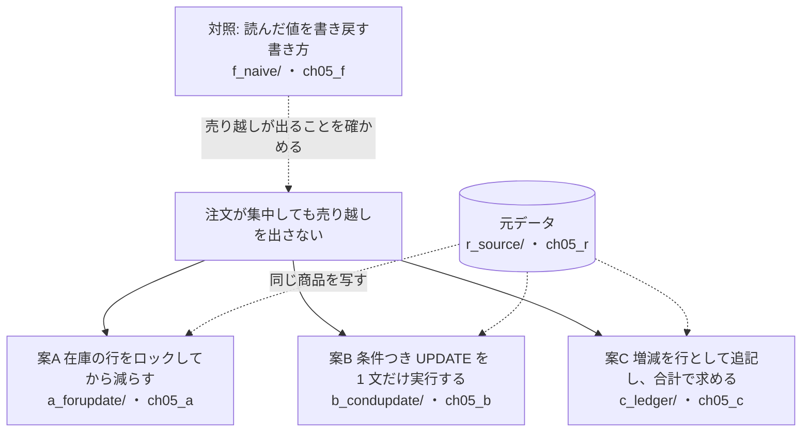
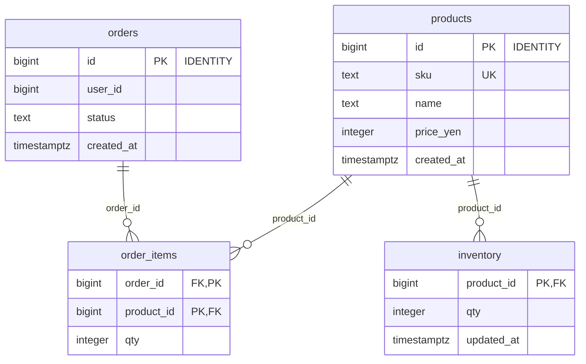
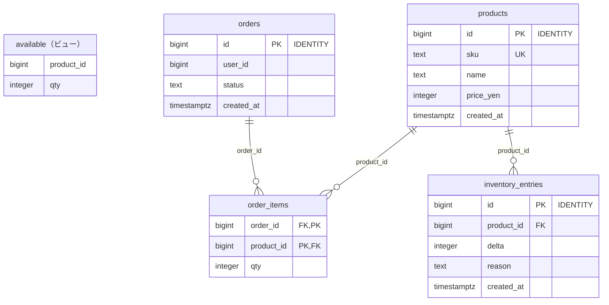
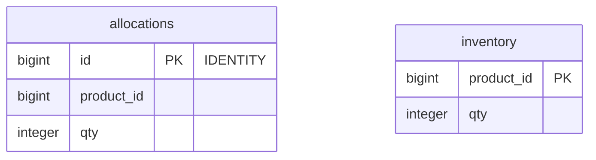

# 第5章 注文と在庫の引当　注文が集中しても売り越しを出さない

書籍『PostgreSQLで学ぶDB設計の教科書』第5章のサンプルです。

同じ商品に注文が集中したときに在庫を引き当てる仕組みを、3 つの案で作り、16 接続で同時に流して比べます。

## この章で決めること

- 在庫を列で持って減らすか、増減の行を追記して合計で求めるか
- 在庫を読んでから書くまでのあいだに、ほかの注文をどう締め出すか
- 複数の商品をまとめて引き当てるとき、ロックを取る順序をどうそろえるか
- 分離レベルを上げて正しさを買う案の代償

## 案の見取り図



- `f_naive/` は、なぜロックが要るのかを見せるための対照です。在庫の列に `CHECK (qty >= 0)` を付けても売り越します

## 各案のテーブル

### 案A 在庫の行をロックしてから減らす（`ch05_a`）

<!-- ER:ch05_a -->

<!-- /ER -->

### 案B 条件つき UPDATE を 1 文だけ実行する（`ch05_b`）

案A と同じテーブルで、引当の関数（`schema_50_function.sql`）の書き方だけが違います。

<!-- ER:ch05_b -->

<!-- /ER -->

### 案C 増減を行として追記し、合計で求める（`ch05_c`）

在庫の現在値は、増減の行を合計するビュー `available` で求めます。

<!-- ER:ch05_c -->

<!-- /ER -->

### 対照: 読んだ値を書き戻す書き方（`ch05_f`）

<!-- ER:ch05_f -->

<!-- /ER -->

## 動かし方

```bash
# 1. テーブルとデータを作り、1 接続での確認・サイズ・変更の手数を取る（既定は M = 1 万商品）
bash ch05_order_and_inventory/run_measure.sh

# 2. 16 接続で同時に流す（集中・分散・複数商品・REPEATABLE READ）
bash ch05_order_and_inventory/run_bench.sh > ch05_order_and_inventory/results/bench_M.txt

# やり直すときは、この章のスキーマだけを消す
bash scripts/reset-chapter.sh 05
```

- `queries/after_hot_*.sql` は、pgbench の直後に売り越しを数える検査です。単独で流しても意味がありません（`run_bench.sh` が流します）
- `queries/40_lock_waits.sql` は、測定中に別の接続から流してロック待ちを観察する SQL です
- `f_naive/count_oversold.sql` は、0 にならないのが正しい検査です（対照の案が売り越すことを数える）

## どの案を選ぶか（書籍の「条件ごとの選び方」の要点）

- 引当の理由や時刻を残す必要がないなら案B（最も短く、読んでから書くまでの隙間が構造として無い）
- 引当の前に在庫以外の検査（購入制限など）が要るなら案A
- 「いつ・なぜ在庫が動いたか」を残すことが要件なら案C
- 複数の商品をまとめて引き当てるなら、案によらずロックの順序をそろえる

## ファイル一覧

先頭のコメントの 1 行目を添えています。

<details>
<summary>開く</summary>

<!-- FILES -->
- `run_bench.sh` … 第5章の同時実行の測定。
- `run_measure.sh` … 第5章の results/ を取り直す。スキーマを消して作り直すところから始める。
- `a_forupdate/`
  - `load.sql` … 元データを写す。測定のたびに入れ直すので、在庫も毎回 100 個に戻る
  - `schema.sql` … 案A: 在庫の行を SELECT ... FOR UPDATE でロックしてから減らす
  - `schema_50_function.sql` … 案A の引当。1 回の関数呼び出しにまとめる（案の間で往復の回数をそろえる規約）。
  - `verify_content.sql` … 元データと同じ商品と在庫が入っているか（全行の先頭列が 0 になること）
- `b_condupdate/`
  - `load.sql` … 元データを写す。測定のたびに入れ直すので、在庫も毎回 100 個に戻る
  - `schema.sql` … 案B: 条件つき UPDATE を 1 文だけ実行する
  - `schema_50_function.sql` … 案B の引当。UPDATE 1 文で済ませる。
  - `verify_content.sql` … 元データと同じ商品と在庫が入っているか（全行の先頭列が 0 になること）
- `bench/`
  - `a_hot.sql` … 案A: 1 商品への集中。在庫 100 個の商品 1 に注文が集中する
  - `a_many_sorted.sql` … 案A: 3 商品の一括引当。ロックを商品 id の昇順に取る
  - `a_many_unsorted.sql` … 案A: 3 商品の一括引当。ロックを渡された順のまま取る（そろえない）
  - `a_spread.sql` … 案A: 1 万商品への分散。人気商品に偏らせる（均等な乱数では衝突が起きず、案の差が出ない）
  - `b_hot.sql` … 案B: 1 商品への集中
  - `b_many.sql` … 案B: 3 商品の一括引当。更新の順序は PostgreSQL が決める
  - `b_spread.sql` … 案B: 1 万商品への分散
  - `c_hot.sql` … 案C: 1 商品への集中
  - `c_nolock_hot.sql` … 案C からロックを外した版。売り越しが出ることの実証に使う
  - `c_spread.sql` … 案C: 1 万商品への分散
  - `f_naive_hot.sql` … 読んだ値を書き戻す案。在庫 100 個の 1 商品に集中させる
  - `rr.sql` … REPEATABLE READ で条件つき UPDATE を同時実行する。
- `c_ledger/`
  - `load.sql` … 元データを写す。案C は在庫数の列を持たないので、初期在庫を入荷の行として追記する
  - `schema.sql` … 案C: 在庫の増減を行として追記し、有効在庫を集計で導出する
  - `schema_50_function.sql` … 案C の引当。合計を取ってから、足りれば負の行を追記する。
  - `verify_content.sql` … 元データと同じ商品が入り、入荷の合計が初期在庫と一致するか（全行の先頭列が 0 になること）
- `change/`
  - `10_b_to_c.sql` … 変更シナリオ: 案B（在庫の列）から案C（増減の追記）へ移す
- `f_naive/`
  - `count_oversold.sql` … この検査は 0 にならないのが正しい結果。だから verify*.sql という名前にしない（verify*.sql は「全行の先頭列が 0」を機械検査される規約のため）。
  - `load.sql` … 在庫 100 個の商品 1 件だけを置く。16 接続がこの 1 件を取り合う形にする。
  - `schema.sql` … 検算用: 読んだ値を書き戻す書き方
- `queries/`
  - `10_single_connection.sql` … 単一接続では 3 案の区別が付かない。
  - `20_pg18_features.sql` … 第5章で使う機能を、最小の例で確かめる。本文で断定する前に、この出力を根拠にする。
  - `30_ledger_scale.sql` … 案C の集計が何に比例するかを測る。
  - `40_lock_waits.sql` … 待ち行列の実測。ロックの順序をそろえない測定を流している最中に、別の接続から実行する。
  - `90_sizes.sql` … 3 案の保存サイズ。本体とインデックスを分けて出す。
  - `after_hot_a.sql` … このファイルは pgbench の測定の直後にだけ意味がある（run_bench.sh が流す）。
  - `after_hot_b.sql` … このファイルは pgbench の測定の直後にだけ意味がある（run_bench.sh が流す）。
  - `after_hot_c.sql` … このファイルは pgbench の測定の直後にだけ意味がある（run_bench.sh が流す）。
- `r_source/`
  - `schema_10_table.sql` … 3 案に同じ商品を入れるための元データ。
  - `schema_20_generate.sql` … 商品を生成する。SIZE=S なら 1,000 商品、M なら 10,000 商品。
<!-- /FILES -->

</details>

## results/

採取した出力です。先頭に `bash scripts/collect-env.sh` の出力（版・設定・日時）が付いています。
ファイル名の `_M` は、そのデータ量で取ったことを表します。書籍の図と数値は M です。
