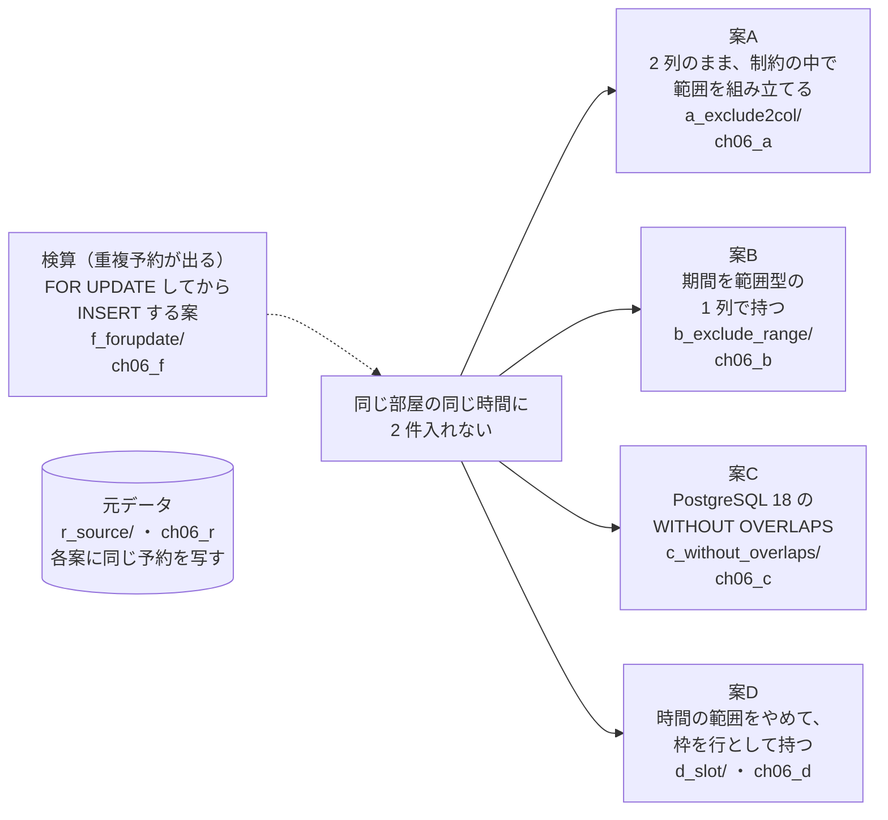
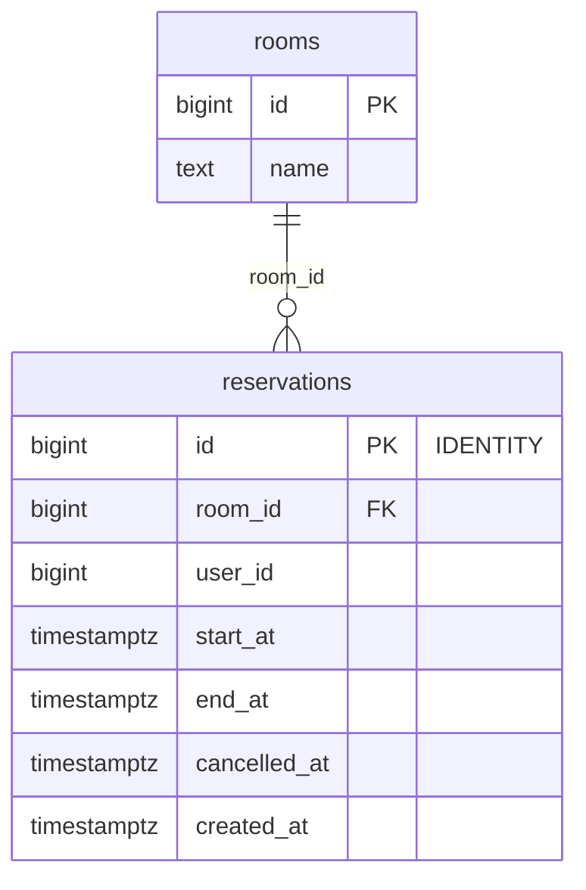
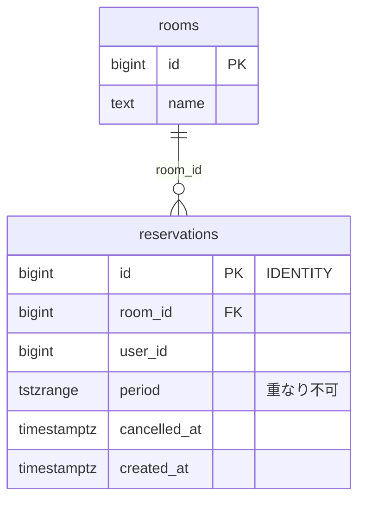
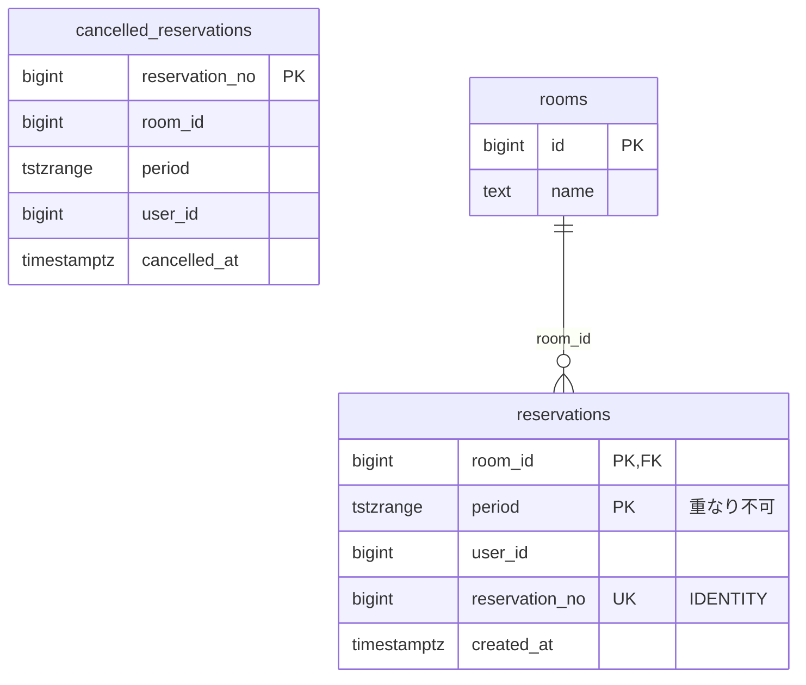
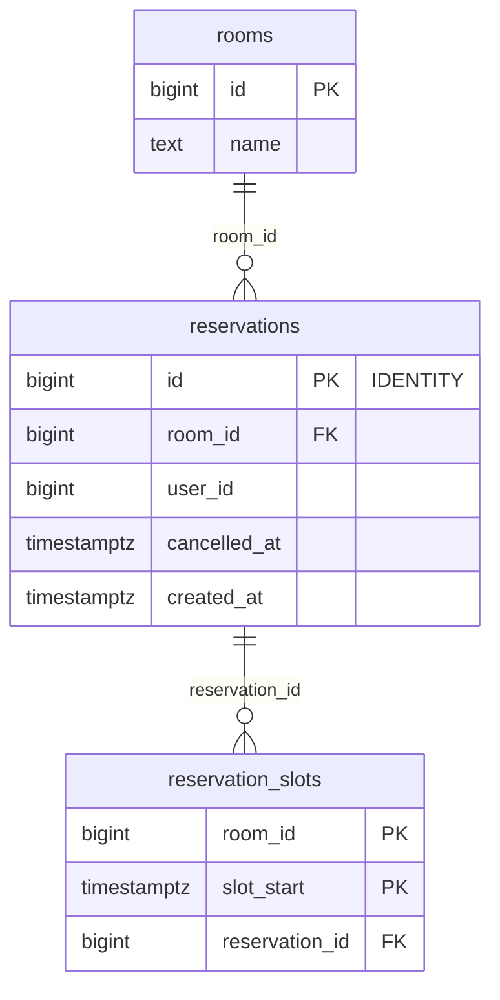

# 第6章 予約　同じ部屋の同じ時間に2件入れない

書籍『PostgreSQLで学ぶDB設計の教科書』第6章のサンプルです。

会議室の予約で、同じ部屋の同じ時間に 2 件入らないことを、4 つの案で守り、人気の部屋に 16 接続で申し込みを集中させて比べます。

## この章で決めること

- 時間の重なりを、アプリで確かめてから登録するか、データベースの制約に任せるか
- 開始・終了を 2 列で持つか、範囲型の 1 列で持つか
- 排他制約（`EXCLUDE`）と、PostgreSQL 18 の `WITHOUT OVERLAPS` のどちらを使うか
- 固定の枠を行として持つ案が成り立つ条件

## 設計案の構成図



- `f_forupdate/` は、要件だけを AI に渡して出てきた案です。1 接続では正しく動きますが、同時に申し込むと重複予約ができます
- 各案の `verify.sql` は、重なっている予約の組を数えます（0 であること）

## 各案のテーブル

### 案A 2 列のまま、制約の中で範囲を組み立てる（`ch06_a`）

<!-- ER:ch06_a -->

<!-- /ER -->

### 案B 期間を範囲型の 1 列で持つ（`ch06_b`）

<!-- ER:ch06_b -->

<!-- /ER -->

### 案C PostgreSQL 18 の WITHOUT OVERLAPS（`ch06_c`）

`WITHOUT OVERLAPS` には `WHERE` を付けられないので、キャンセルした予約は別のテーブルに移します。

<!-- ER:ch06_c -->

<!-- /ER -->

### 案D 時間の範囲をやめて、枠を行として持つ（`ch06_d`）

<!-- ER:ch06_d -->

<!-- /ER -->

### 検算: 最初に思いつく案（`ch06_f`）

<!-- ER:ch06_f -->

<!-- /ER -->

## 動かし方

```bash
# 1. テーブルとデータを作り、1 接続での確認・検索・サイズ・変更の手数を取る（既定は M = 1 万部屋）
bash ch06_reservation/run_measure.sh

# 2. 人気の部屋に 16 接続で申し込みを集中させる（各案 5 回ずつ）
bash ch06_reservation/run_bench.sh > ch06_reservation/results/bench_M.txt 2>&1

# やり直すときは、この章のスキーマだけを消す
bash scripts/reset-chapter.sh 06
```

- `change/10_a_to_b.sql` は、2 列の案A を範囲型の案B へ移す手順です（`ROLLBACK` で終わり、テーブルは変わりません）
- `*_fails.sql` は失敗するのが正しいファイルです（`WITHOUT OVERLAPS` に `WHERE` は付けられない、など）

## どの案を選ぶか（書籍の「条件ごとの選び方」の要点）

- 既にあるテーブルに開始・終了の 2 列があるなら案A（列の形を変えずに制約だけを足せる）
- 新しく作るテーブルで、期間を使った検索が多いなら案B
- キャンセルを別のテーブルで管理でき、期間つき外部キーを使う予定があるなら案C
- 枠の長さが固定で、拡張を入れたくない、または他のデータベースへ移す可能性があるなら案D
- どの案でも、検索に使う列のインデックスは別に用意する（制約のインデックスは探すためのものではない）

## ファイル一覧

先頭のコメントの 1 行目を添えています。

<details>
<summary>開く</summary>

<!-- FILES -->
- `run_bench.sh` … 第6章の同時実行の測定。
- `run_measure.sh` … 第6章の results/ を取り直す。スキーマを消して作り直すところから始める。
- `a_exclude2col/`
  - `load.sql` … 元データを写す
  - `schema.sql` … 案A: 開始・終了を 2 列のまま持ち、排他制約の中で範囲を組み立てる
  - `schema_50_function.sql` … 案A の予約登録。いきなり INSERT し、制約違反を捕まえる。
  - `verify.sql` … 重なっている有効な予約の組（0 であること）
- `b_exclude_range/`
  - `load.sql` … 元データを写す。開始・終了の 2 列を範囲型の 1 列にまとめる
  - `schema.sql` … 案B: 期間を範囲型の 1 列で持ち、排他制約で守る
  - `schema_50_function.sql` … 案B の予約登録。案A と同じ形で、範囲型を組み立てて入れる
  - `verify.sql` … 重なっている有効な予約の組（0 であること）。範囲型なので && で書ける
- `bench/`
  - `a_hot.sql` … 案A: 人気の部屋への集中。
  - `b_hot.sql` … 案B: 人気の部屋への集中。
  - `c_hot.sql` … 案C: 人気の部屋への集中。
  - `d_hot.sql` … 案D: 人気の部屋への集中。
  - `f_hot.sql` … 検算の案: 人気の部屋への集中。
- `c_without_overlaps/`
  - `20_where_fails.sql` … WITHOUT OVERLAPS に WHERE は付けられない。
  - `load.sql` … 元データを写す。
  - `schema.sql` … 案C: PostgreSQL 18 の PRIMARY KEY (..., period WITHOUT OVERLAPS)
  - `schema_50_function.sql` … 案C の予約登録。主キーの違反を捕まえる。
  - `verify.sql` … 重なっている予約の組（0 であること）。本体にはキャンセル済みが入らない
- `change/`
  - `10_a_to_b.sql` … 変更の手数: 2 列で作った表（案A）を、範囲型の 1 列（案B）へ移す。
  - `20_not_valid_fails.sql` … 排他制約は NOT VALID で足せない。
  - `30_lock_modes.sql` … 移行の各段階で、どのロックを取るかを 1 つずつ確かめる。
- `d_slot/`
  - `load.sql` … 元データを写す。1 件の予約を、占める枠の行に展開する
  - `schema.sql` … 案D: 時間枠を行として持ち、UNIQUE (room_id, slot_start) で守る
  - `schema_50_function.sql` … 案D の予約登録。予約の行を入れ、占める枠を展開して入れる。
  - `verify.sql` … 1 つの枠を 2 件の有効な予約が占めていないこと（0 であること）。
- `f_forupdate/`
  - `count_overlaps.sql` … 重なっている予約の組を数える。
  - `load.sql` … 元データを写す。測定のたびに入れ直す
  - `schema.sql` … 検算の対象: 重なる予約を SELECT ... FOR UPDATE でロックしてから INSERT する
  - `schema_50_function.sql` … 採取した案（haiku）の予約登録を、そのまま関数にしたもの。
- `queries/`
  - `10_single_connection.sql` … 1 接続で試すかぎり、検算の対象の案は要件どおりに動く。
  - `20_pg18_features.sql` … PostgreSQL 18 の WITHOUT OVERLAPS と、EXCLUDE との機能の違いを実機で確かめる。
  - `30_find_free.sql` … 「ある日のある部屋の空き時間」を求める。
  - `40_search_index.sql` … 排他制約のインデックスは「守る」ためのもので、「探す」ためのものではない。
  - `90_sizes.sql` … 案ごとの保存サイズ。表とインデックスを分けて出す。
- `r_source/`
  - `schema_10_table.sql` … 4 案に同じ予約を入れるための元データ。
  - `schema_20_generate.sql` … 部屋と、既にある予約を生成する。
<!-- /FILES -->

</details>

## results/

採取した出力です。先頭に `bash scripts/collect-env.sh` の出力（版・設定・日時）が付いています。
ファイル名の `_M` は、そのデータ量で取ったことを表します。書籍の図と数値は M です。
