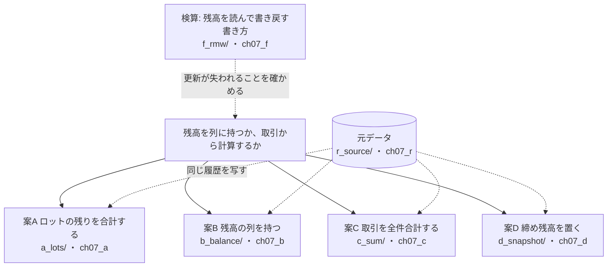
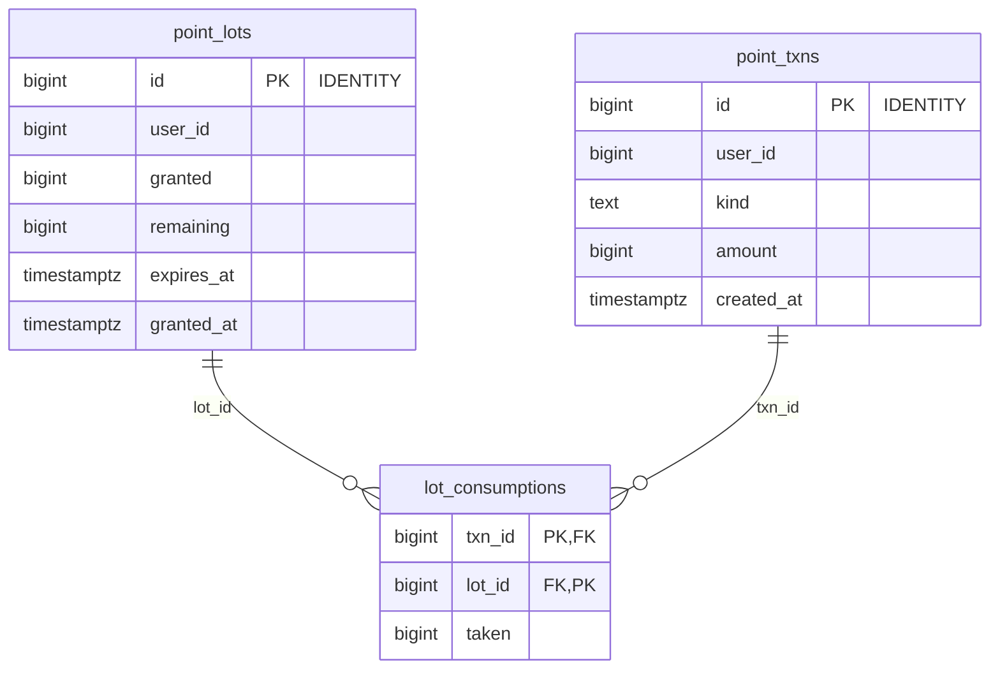
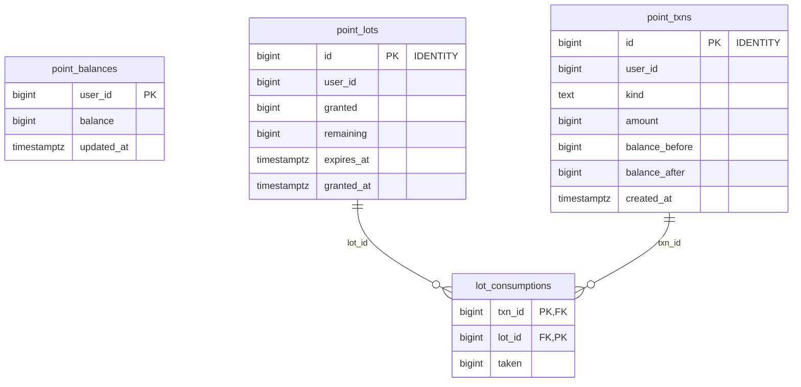
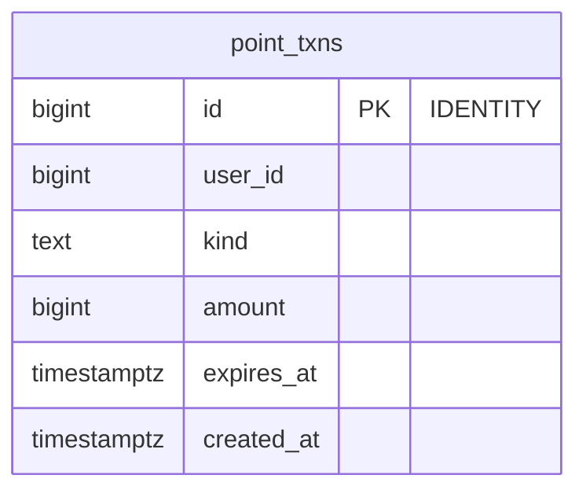
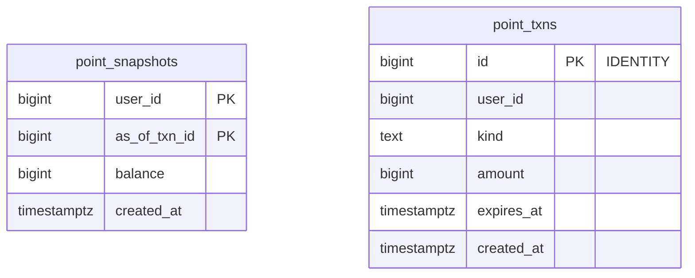
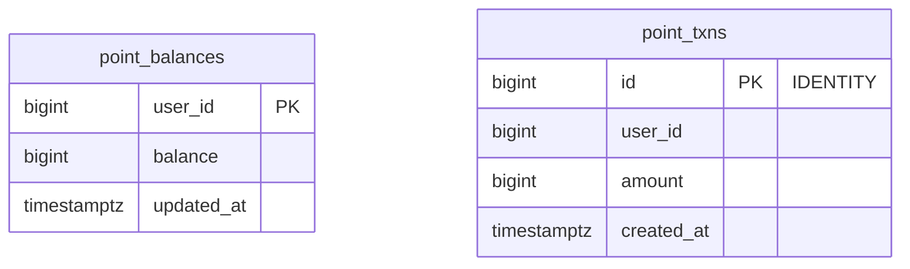

# 第7章 ポイント残高　残高を列に持つか、取引から計算するか

書籍『PostgreSQLで学ぶDB設計の教科書』第7章のサンプルです。

有効期限つきのポイントの残高を、4 つの案で持ち、同じ取引の履歴を入れて比べます。

## この章で決めること

- 残高を列に持つか、そのつど計算するか
- 有効期限つきのポイントを、どの単位で持つか
- 期限切れのポイントを、いつ残高から外すか
- 同じ会員に複数の端末から書き込まれたとき、何で守るか

## 案の見取り図



- 同じ履歴を入れても、案によって残高の値そのものが変わります。案A は期限切れを問い合わせのたびに外し、ほかの案は失効の処理が走るまで数えます

## 各案のテーブル

### 案A ロットの残りを合計する（`ch07_a`）

<!-- ER:ch07_a -->

<!-- /ER -->

### 案B 残高の列を持つ（`ch07_b`）

<!-- ER:ch07_b -->

<!-- /ER -->

### 案C 取引を全件合計する（`ch07_c`）

<!-- ER:ch07_c -->

<!-- /ER -->

### 案D 締め残高を置く（`ch07_d`）

<!-- ER:ch07_d -->

<!-- /ER -->

### 検算: 残高を読んで書き戻す書き方（`ch07_f`）

<!-- ER:ch07_f -->

<!-- /ER -->

## 動かし方

```bash
# 1. テーブルとデータを作り、残高の突き合わせ・照会の計画・消し込みの順序・サイズ・変更の手数を取る
#    （既定は S = 会員 1,000 人。数分で終わる）
bash ch07_point_balance/run_measure.sh

# 2. 同じ会員の 1 行に 16 接続で書き込む（読んで書き戻す / FOR UPDATE / データベースの中で足す）
bash ch07_point_balance/run_bench.sh > ch07_point_balance/results/bench_S.txt 2>&1

# やり直すときは、この章のスキーマだけを消す
bash scripts/reset-chapter.sh 07
```

- `change/10_a_to_b.sql` は、案A に残高の列（案B の形）を足す移行です。`change/11_a_to_b_expired_included.sql` は、
  期限切れを含めた誤った移行を検算が見つけられるかを確かめる canary です（どちらも `ROLLBACK` で終わります）
- `a_lots/30_shortage.sql` は、ロット単位の消し込みが足りなくてもエラーを出さない例です

## どの案を選ぶか（書籍の「条件ごとの選び方」の要点）

- 残高を毎回表示し、履歴の積み上がった会員がいるなら案B（残高の置き場所が 2 か所になるので、食い違いの検査が要る）
- 期限切れを即座に残高から外したいなら案A（読む量は、その会員の生きているロットの件数に比例する）
- 取引が会員あたり数百件までで、残高の表示がまれなら案C
- 取引が長期に積み上がり、過去の時点の残高も問われるなら案D
- どの案でも、同時に書き込まれたときの守り方は別に決める（ロックなしで読んで書き戻すと更新が失われる）

## ファイル一覧

先頭のコメントの 1 行目を添えています。

<details>
<summary>開く</summary>

<!-- FILES -->
- `run_bench.sh` … 第7章の同時実行の測定。
- `run_measure.sh` … 第7章の results/ を取り直す。スキーマを消して作り直すところから始める。
- `a_lots/`
  - `30_shortage.sql` … 「残高が足りないとき、消し込みはエラーにならず引ける分だけ引く」ことを示す。
  - `load.sql` … 元データを写す。
  - `load_20_consume.sql` … 元データの利用を、案A の消し込みで実際に適用する。
  - `schema.sql` … 案A: 残高の列を持たず、付与ロットの残りを合計して残高とする
  - `schema_50_function.sql` … 案A の付与と利用。
  - `verify.sql` … 案A の検査。返す全行の先頭列が 0 であること（0 でなければ検証スクリプトが FAIL にする）
- `b_balance/`
  - `load.sql` … 元データを写す。案A と同じ行を、同じ順で入れる
  - `load_20_consume.sql` … 元データの利用を、案B の消し込みで実際に適用する。
  - `schema.sql` … 案B: 残高の列を持ち、ロットと台帳も持つ
  - `schema_50_function.sql` … 案B の付与と利用。
  - `verify.sql` … 案B の検査。返す全行の先頭列が 0 であること案B の要は「残高の列」と「ロットの残り」の 2 か所が食い違わないことである。
- `bench/`
  - `f_forupdate.sql` … 同じ 1 行（会員 1）に、全接続から 1 ポイントずつ付与する
  - `f_in_db.sql` … 同じ 1 行（会員 1）に、全接続から 1 ポイントずつ付与する
  - `f_naive.sql` … 同じ 1 行（会員 1）に、全接続から 1 ポイントずつ付与する
- `c_sum/`
  - `load.sql` … 元データを写す。案A・案B と同じ行を、同じ順で入れる
  - `schema.sql` … 案C: 台帳だけを持ち、残高は取引の合計で求める
  - `schema_50_function.sql` … 案C の残高。会員の取引を全部読んで合計する。
- `change/`
  - `10_a_to_b.sql` … 変更の手数: 残高の列を持たない案A に、あとから残高の列（案B の形）を足す。
  - `11_a_to_b_expired_included.sql` … 検算が誤りを見つけられるかを確かめる（canary）。
- `d_snapshot/`
  - `load.sql` … 元データを写し、そのあとで締め残高を作る
  - `schema.sql` … 案D: 台帳 + 期間ごとの締め残高
  - `schema_50_function.sql` … 案D の残高。最新の締め残高を 1 行引き、それ以降の取引だけを合計して足す
- `f_rmw/`
  - `load.sql` … 測定の開始点。会員 1 人だけ、残高 0 から始める。
  - `schema.sql` … 検算用: 残高を読んでアプリ側で計算し、書き戻す案
  - `schema_50_function.sql` … 3 つの書き方を並べる。違うのは残高をどう増やすかだけで、台帳への記録は同じ。
- `queries/`
  - `05_balance_agreement.sql` … 4 案に同じ履歴を入れ、同じ会員の残高を問い合わせて突き合わせる。
  - `10_balance_plans.sql` … 残高照会の実行計画を 4 案で比べる。
  - `20_fefo_vs_fifo.sql` … 消し込みの順序を「付与の古い順」にすると何が起きるかを、実データで示す。
  - `90_sizes.sql` … 4 案の保存サイズ。本体と索引を分けて出す。
- `r_source/`
  - `schema_10_table.sql` … 4 案に同じ取引を入れるための元データ。
  - `schema_20_generate.sql` … 会員と、その付与・利用の履歴を生成する。
<!-- /FILES -->

</details>

## results/

採取した出力です。先頭に `bash scripts/collect-env.sh` の出力（版・設定・日時）が付いています。
ファイル名の `_S` は、そのデータ量で取ったことを表します。書籍の図と数値は S です。
