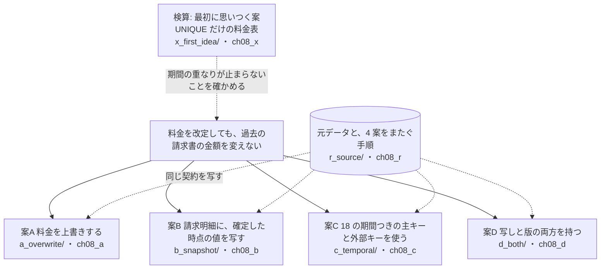
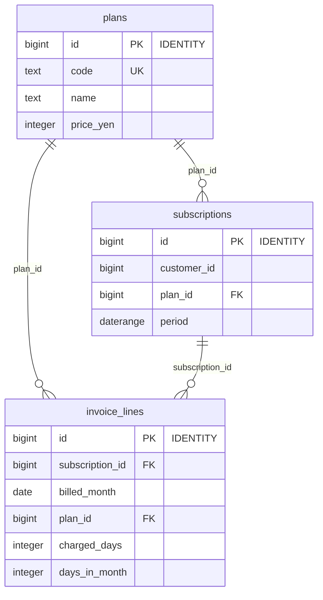
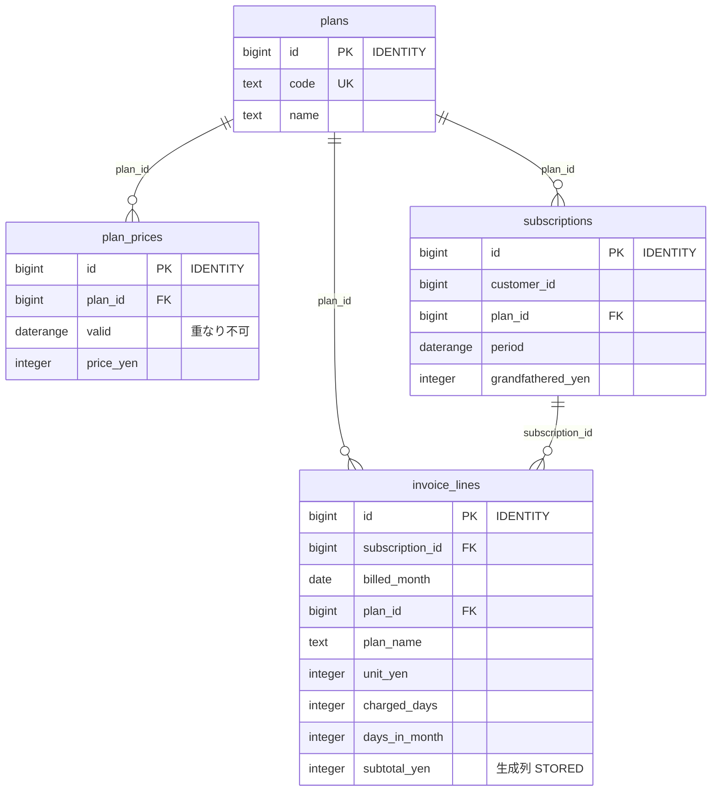
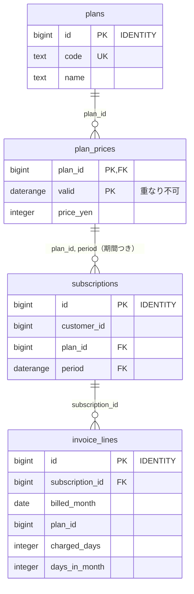
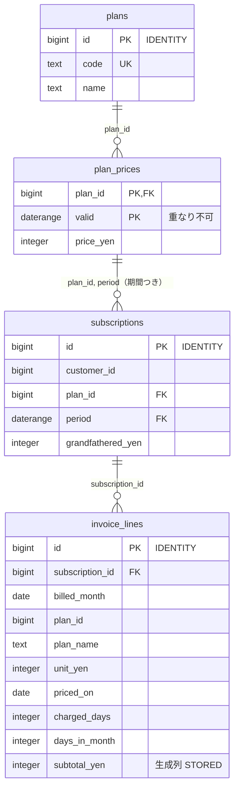
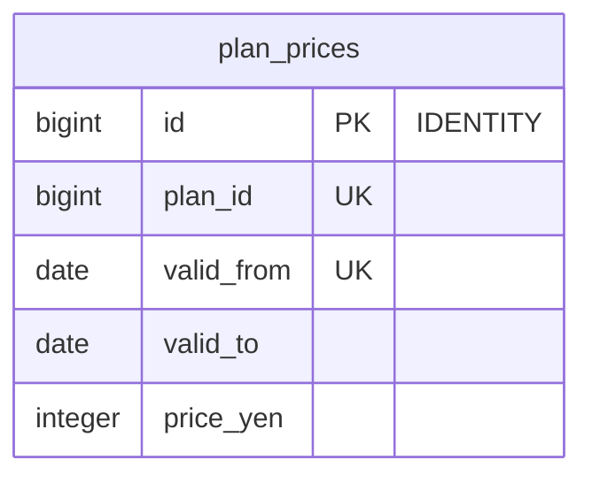

# 第8章 月額課金の料金改定と請求　過去の請求書の金額を変えない

書籍『PostgreSQLで学ぶDB設計の教科書』第8章のサンプルです。

月額課金のサービスで料金を改定したときに、過去に発行した請求書の金額が変わらないかを、4 つの案で確かめます。

## この章で決めること

- 請求した金額を、どこに記録するか
- 料金の改定を、上書きで表すか、期間つきの行（版）で表すか
- 旧料金の据え置き、日割り、消費税の端数の扱い

## 案の見取り図



- この章では、4 案をまたいで流す手順も `r_source/` に置いています。
  `40_issue_april.sql`（4 月分の請求を発行）→ `50_revise_and_reissue.sql`（値上げして再発行し、差額を出す）→ `90_verify.sql`（検査）の順です

## 各案のテーブル

### 案A 料金を上書きする（`ch08_a`）

<!-- ER:ch08_a -->

<!-- /ER -->

### 案B 請求明細に、確定した時点の値を写す（`ch08_b`）

<!-- ER:ch08_b -->

<!-- /ER -->

### 案C 18 の期間つきの主キーと外部キーを使う（`ch08_c`）

<!-- ER:ch08_c -->

<!-- /ER -->

### 案D 写しと版の両方を持つ（`ch08_d`）

<!-- ER:ch08_d -->

<!-- /ER -->

### 検算: 最初に思いつく案（`ch08_x`）

<!-- ER:ch08_x -->

<!-- /ER -->

## 動かし方

```bash
# 全部を取り直す（既定は S。数十秒で終わる）
bash ch08_subscription_pricing_and_billing/run_measure.sh

# やり直すときは、この章のスキーマだけを消す
bash scripts/reset-chapter.sh 08
```

- `c_temporal/45_*_fails.sql`・`46_*_fails.sql` は、案C の料金表を 2 文で改定しようとして止まることを確かめます（失敗するのが正しい）。
  案C の改定は、検査をトランザクションの終わりまで遅らせて行います（`50_revise_and_reissue.sql`）
- `r_source/90_verify.sql` の各行は、先頭の列が 0 なら正常です

## どの案を選ぶか（書籍の「条件ごとの選び方」の要点）

- 過去の請求書を再現できればよく、監査で計算の根拠まで問われないなら案B
- 契約と料金の対応が崩れることを起こしたくないなら案C（据え置きが無いこと、改定の手順を先に決めて `DEFERRABLE` を付けておくことが条件）
- 監査で金額の根拠を出す必要がある事業なら案D
- 案A は、過去の請求書を変えない要件が無い用途（社内の利用集計など）に限る

## ファイル一覧

先頭のコメントの 1 行目を添えています。

<details>
<summary>開く</summary>

<!-- FILES -->
- `run_measure.sh` … 第8章の測定を最初から通しで実行し、results/ に保存する。
- `a_overwrite/`
  - `load.sql` … 元データ（ch08_r）から案A へ写す。
  - `schema.sql` … 案A: 料金をプランの行に持ち、改定は上書きする。請求明細は plan_id だけを持つ。
- `b_snapshot/`
  - `load.sql` … 元データ（ch08_r）から案B へ写す。
  - `schema.sql` … 案B: 請求明細に、確定した時点の値を写す。料金表は版つきにする。
- `c_temporal/`
  - `45_revise_close_first_fails.sql` … 案C の改定を、案B と同じ 2 文で流す（1 文目）。検査を遅らせないと、ここで止まる。
  - `46_revise_insert_first_fails.sql` … 順序を入れ替えて、先に新しい版を足す。今の版（上端なし）と期間が重なり、主キーに弾かれる。
  - `load.sql` … 元データ（ch08_r）から案C へ写す。
  - `schema.sql` … 案C: 料金表の版を 18 の期間つき主キーで持ち、契約から期間つき外部キーで参照する。
- `d_both/`
  - `load.sql` … 元データ（ch08_r）から案D へ写す。案C と同じ制約が働く。
  - `schema.sql` … 案D: 案B（明細に写す）と案C（版つき + 期間つき外部キー）の併用。
- `queries/`
  - `30_tax_rounding.sql` … 消費税の端数処理を、2 つの計算のしかたで出して比べる。
  - `40_sizes_and_plan.sql` … 4 案の保存サイズと、月次請求の計算の実行計画。
- `r_source/`
  - `40_issue_april.sql` … 2024 年 4 月分の請求を、4 案すべてで発行する。
  - `50_revise_and_reissue.sql` … 料金を改定してから、同じ 2024 年 4 月分を「再発行」して、改定前の金額と比べる。
  - `90_verify.sql` … 第8章の検査。返す行の先頭列がすべて 0 なら正常。
  - `schema_10_table.sql` … 4 案に同じ契約・同じ料金改定を入れるための元データ。
  - `schema_20_generate.sql` … 契約と料金の版を生成する。
- `x_first_idea/`
  - `load.sql` … 開始日が違うだけの、期間の重なる 2 行。UNIQUE は通してしまう。
  - `schema.sql` … 採取した案（3 本のうち 2 本）が書いた料金表。本書はこの形を採用しない。
<!-- /FILES -->

</details>

## results/

採取した出力です。先頭に `bash scripts/collect-env.sh` の出力（版・設定・日時）が付いています。
ファイル名の `_S` は、そのデータ量で取ったことを表します。書籍の図と数値は S です。
