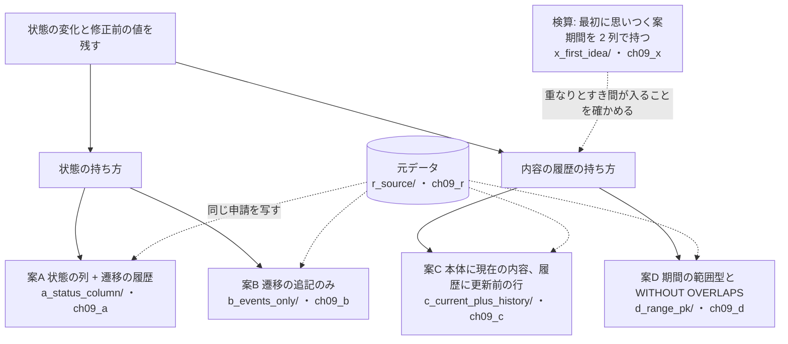
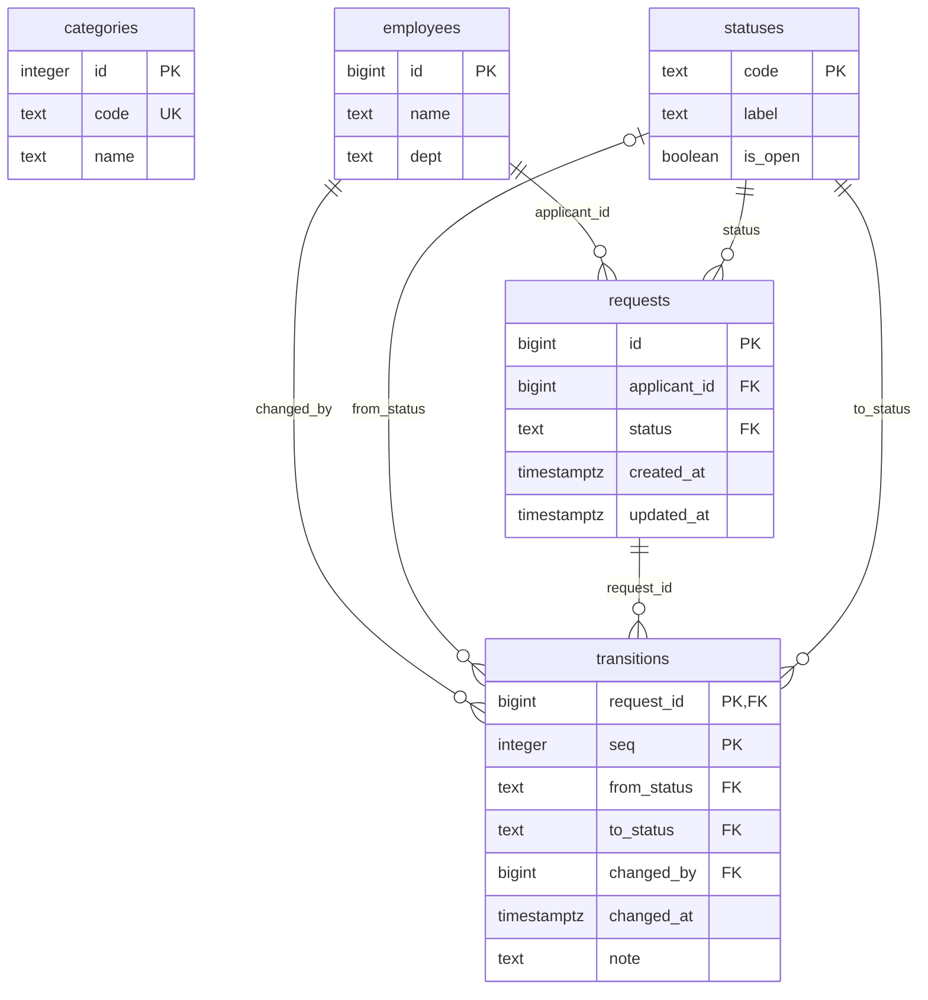
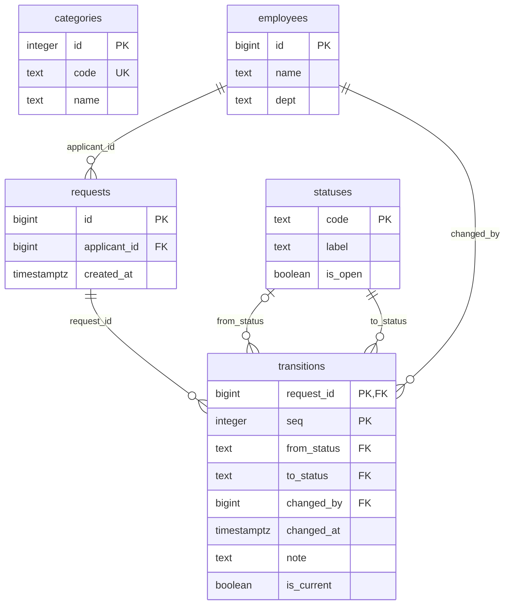
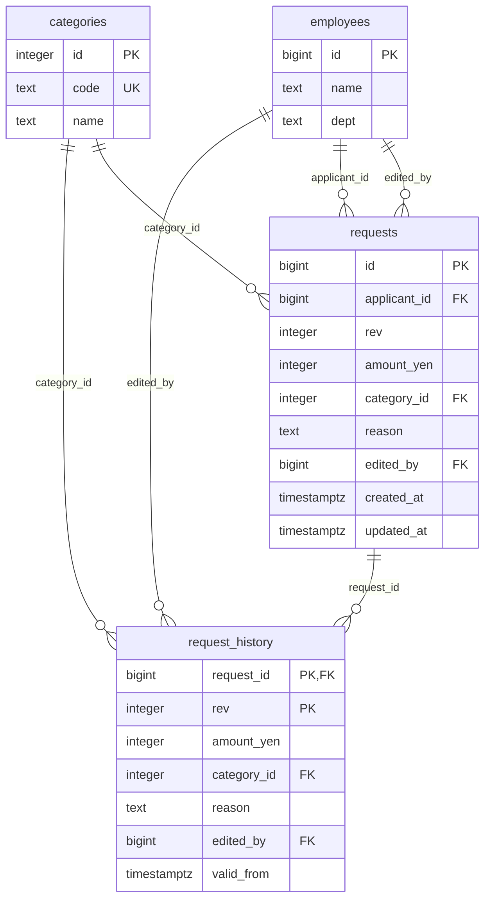
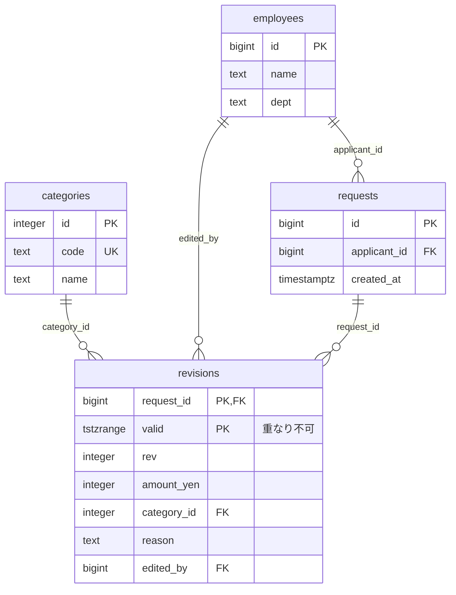
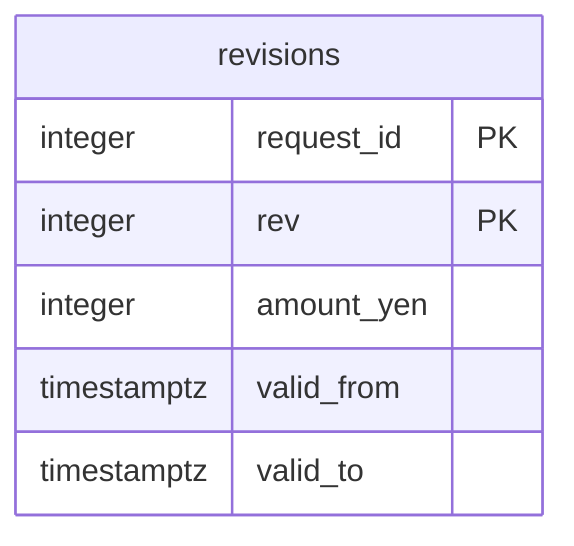

# 第9章 申請と承認　状態の変化と修正前の値を残す

書籍『PostgreSQLで学ぶDB設計の教科書』第9章のサンプルです。

経費の申請と承認のワークフローで、「いまどの状態か」と「修正前に何が書かれていたか」を残す方法を、2 段に分けて比べます。

## この章で決めること

- 状態を列に持つか、遷移の履歴から導くか
- 「いつ・誰が・なぜ」状態を変えたかに答えられる形
- 修正前の内容をどこに残すか
- ある時点の内容を 1 つに決められる形

## 案の見取り図



## 各案のテーブル

### 案A 状態の列 + 遷移の履歴（`ch09_a`）

<!-- ER:ch09_a -->

<!-- /ER -->

### 案B 遷移の追記のみ（`ch09_b`）

<!-- ER:ch09_b -->

<!-- /ER -->

### 案C 本体に現在の内容、履歴に更新前の行（`ch09_c`）

<!-- ER:ch09_c -->

<!-- /ER -->

### 案D 期間の範囲型と WITHOUT OVERLAPS（`ch09_d`）

<!-- ER:ch09_d -->

<!-- /ER -->

### 検算: 最初に思いつく案（`ch09_x`）

<!-- ER:ch09_x -->

<!-- /ER -->

## 動かし方

```bash
# 全部を取り直す（既定は S）
bash ch09_request_and_approval/run_measure.sh

# 1 つずつ流すとき（元データ → 案A のテーブル → データ → 状態の型を変えるときのロック）
bash scripts/run-sql.sh book_owner ch09_r ch09_request_and_approval/r_source/schema_10_table.sql
SIZE=S bash scripts/run-sql.sh book_owner ch09_r ch09_request_and_approval/r_source/schema_20_generate.sql
bash scripts/run-sql.sh book_owner ch09_a ch09_request_and_approval/a_status_column/schema.sql
bash scripts/run-sql.sh book_owner ch09_a ch09_request_and_approval/a_status_column/load.sql
bash scripts/run-sql.sh book_owner ch09_a ch09_request_and_approval/a_status_column/30_status_type_locks.sql

# やり直すときは、この章のスキーマだけを消す
bash scripts/reset-chapter.sh 09
```

- `queries/10_inbox.sql` は状態の 2 案（A・B）、`queries/20_asof.sql` は内容の履歴の 2 案（C・D）を比べます。どちらも比べる案のテーブルが両方そろってから流します（`run_measure.sh` が流します）
- `change/10_migrate_c_to_d.sql` は、案C から案D への移行です
- `*_fails.sql` は失敗するのが正しいファイルです（案D は重なる期間と空の期間を拒否する）

## どの案を選ぶか（書籍の「条件ごとの選び方」の要点）

- 状態の持ち方は、追記のみを守るか、一覧画面を速くするかで分かれ、両方は取れない
  - 一覧画面が主で、更新が 1 か所に集まってよいなら案A（状態の列と履歴の食い違いを定期的に数える）
  - 監査の問い合わせが主で、一覧画面が無いなら案B
- 内容の履歴は、ある時点の全件を日常的に問うなら案D、現在の内容を読むのがほとんどなら案C
- 期間の重なりを絶対に入れたくないなら案D（すき間はどちらの案も検査しないので、別に数える）

## ファイル一覧

先頭のコメントの 1 行目を添えています。

<details>
<summary>開く</summary>

<!-- FILES -->
- `run_measure.sh` … 第9章の測定を最初から通しで実行し、results/ に保存する。
- `a_status_column/`
  - `30_status_type_locks.sql` … 状態の型を 3 通り作り、「値を 1 つ足す」ときに取るロックを比べる。
  - `load.sql` … 案A に元データを写す。
  - `schema.sql` … 案A: 申請に状態の列を持ち、遷移の履歴を別の表に追記する。
- `b_events_only/`
  - `load.sql` … 案B に元データを写す。状態の列が無いので、写すのは申請と遷移だけ。
  - `schema.sql` … 案B: 状態の列を持たず、遷移の追記だけで状態を表す。
- `c_current_plus_history/`
  - `40_returning_old.sql` … 18 の RETURNING old / new で、更新と履歴への保存を 1 文で書く。
  - `load.sql` … 案C に元データを写す。
  - `schema.sql` … 案C: 申請の本体に現在の内容を持ち、修正するたびに「更新前の行」を履歴へ写す。
- `change/`
  - `10_migrate_c_to_d.sql` … 変更の手数: 案C（本体 + 履歴）から案D（範囲型 + WITHOUT OVERLAPS）へ移す。
- `d_range_pk/`
  - `20_overlap_fails.sql` … 採取した案で通ってしまった INSERT を、WITHOUT OVERLAPS の表に入れると拒否されることを示す。
  - `21_empty_range_fails.sql` … 案C から案D へ移すとき、本体と履歴に同じ版が二重にあると何が起きるかを示す。
  - `load.sql` … 案D に元データを写す。
  - `schema.sql` … 案D: 内容の版を、期間の範囲型 1 列で持ち、重なりをデータベースに検査させる。
- `queries/`
  - `10_inbox.sql` … 一覧「申請中を新しい順に 20 件」を、状態の 2 案で測る。
  - `20_asof.sql` … 内容の履歴を、案C（本体 + 履歴）と案D（範囲型 + WITHOUT OVERLAPS）で測る。
  - `50_sizes.sql` … 4 案の保存サイズ。本体とインデックスを分けて出す。
  - `90_verify.sql` … 第9章の検査。すべて先頭列が 0 で正常。
- `r_source/`
  - `schema_10_table.sql` … 元データ。4 つの案は、ここから同じ中身を写して作る。
  - `schema_20_generate.sql` … 申請・状態の遷移・内容の版を生成する。
- `x_first_idea/`
  - `load.sql` … 採取した案の検算。
  - `schema.sql` … 採取した案の検算に使う表。
<!-- /FILES -->

</details>

## results/

採取した出力です。先頭に `bash scripts/collect-env.sh` の出力（版・設定・日時）が付いています。
ファイル名の `_S` は、そのデータ量で取ったことを表します。書籍の図と数値は S です。
