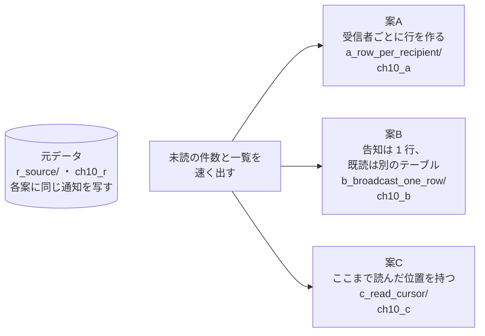
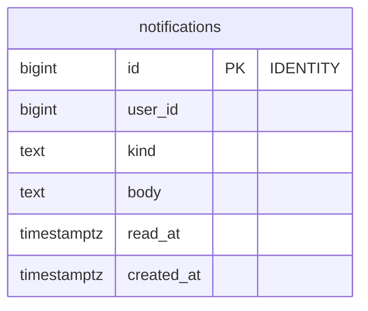
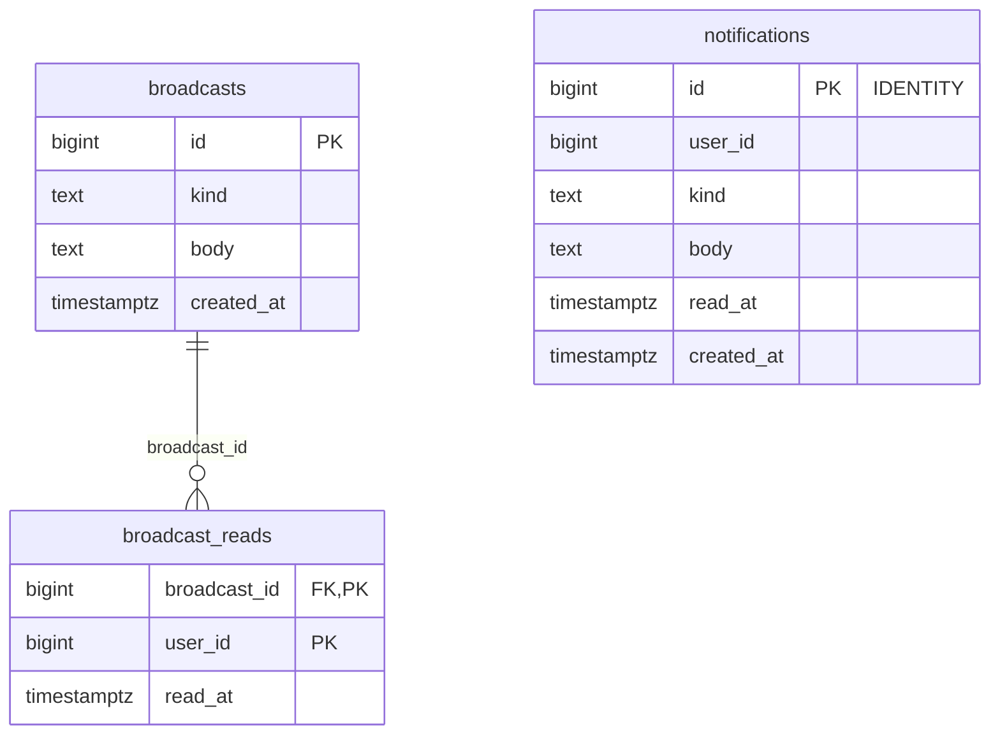
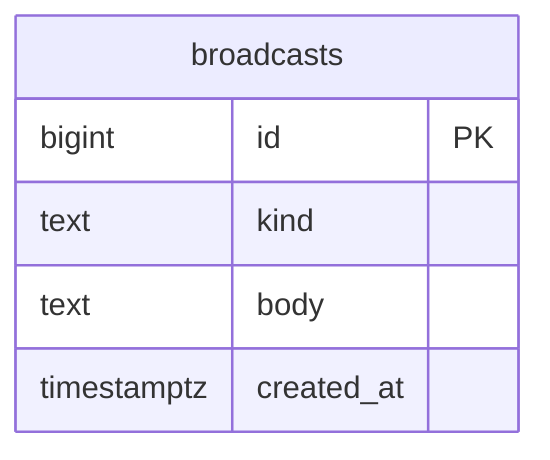
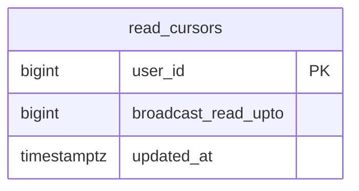

# 第10章 通知と既読　未読の件数と一覧を速く出す

書籍『PostgreSQLで学ぶDB設計の教科書』第10章のサンプルです。

社内向けの Web サービスの通知で、全員への告知と既読の持ち方を、3 つの案で比べます。

## この章で決めること

- 全員への告知を、受信者の数だけ行にするか、1 行にするか
- 既読を 1 件ごとに持つか、「ここまで読んだ」位置で持つか
- 未読の件数を、そのつど数えるか
- 90 日より古い通知を、どう消すか

## 設計案の構成図



## 各案のテーブル

### 案A 受信者ごとに行を作る（`ch10_a`）

<!-- ER:ch10_a -->

<!-- /ER -->

### 案B 告知は 1 行、既読は別のテーブル（`ch10_b`）

<!-- ER:ch10_b -->

<!-- /ER -->

### 案C ここまで読んだ位置を持つ（`ch10_c`）

<!-- ER:ch10_c -->
テーブルが多く、1 つの図では字が小さくなるので、3 つの図に分けています。外部キーの参照先が別の図にあるときは、列に FK と付いています。





<!-- /ER -->

## 動かし方

```bash
# 全部を取り直す（既定は S）
bash ch10_notification_and_read_status/run_measure.sh

# やり直すときは、この章のスキーマだけを消す
bash scripts/reset-chapter.sh 10
```

- `a_row_per_recipient/60_delete_old.sql` と `61_detach_old.sql` は、古い通知を行の削除で消す方法と、パーティションを切り離して消す方法です
- `change/10_add_partitioning.sql` は、あとからパーティションに移す手順です（どこで失敗するかを確かめる）
- `queries/90_verify.sql` は、3 案が同じ答えを返すことを確かめます

## どの案を選ぶか（書籍の「条件ごとの選び方」の要点）

- 告知がほとんど無いなら案A（1 つのテーブルで完結する）
- 告知があり、どの告知を読んだかを個別に知りたいなら案B
- 告知が多く、既読の粒度を捨ててよいなら案C（未読を多めに見せる側に倒すことを、設計として決める）
- 未読の件数のためのカウンタ列は、この規模では不要（部分インデックスがあれば数えられる）
- 90 日で消すなら、最初からパーティションにしておく

## ファイル一覧

先頭のコメントの 1 行目を添えています。

<details>
<summary>開く</summary>

<!-- FILES -->
- `make_send_compare.sh` … 告知 1 件の配信コストを、案A と案B のログから 1 つの表にまとめる。
- `run_measure.sh` … 第10章の測定を最初から通しで実行し、results/ に保存する。
- `a_row_per_recipient/`
  - `30_send_broadcast.sql` … 案A で全員向けの告知を 1 件送る。受信者の数だけ行を作る。
  - `40_mark_all_read.sql` … 案A で「すべて既読にする」。未読の行をすべて書き換える。
  - `50_index_size.sql` … 部分インデックスと全行インデックスのサイズを比べる。
  - `60_delete_old.sql` … 90 日より古い通知を消す。2 つのやり方を比べる。
  - `61_detach_old.sql` … パーティションを切り離して落とす。60_delete_old.sql の続き。
  - `load.sql` … 案A に元データを写す。
  - `schema.sql` … 案A: 受信者ごとに行を作る（fan-out on write）
- `b_broadcast_one_row/`
  - `30_send_broadcast.sql` … 案B で全員向けの告知を 1 件送る。行は 1 つしか作らない。
  - `50_target_shapes.sql` … 通知の対象（「何についての通知か」）の持ち方を 3 通り比べる。
  - `load.sql` … 案B に元データを写す。
  - `schema.sql` … 案B: 全員向けの告知は 1 行だけ持ち、既読を別の表に記録する（fan-out on read）
- `c_read_cursor/`
  - `40_mark_all_read.sql` … 案C で「すべて既読にする」。
  - `load.sql` … 案C に元データを写す。
  - `schema.sql` … 案C: 利用者ごとに「ここまで読んだ」位置を持つ
- `change/`
  - `10_add_partitioning.sql` … 変更シナリオ: あとからパーティションを入れる。
- `queries/`
  - `10_unread_count.sql` … 未読件数と未読 20 件。ヘッダーに常に表示されるので、最も頻度が高い問い合わせ。
  - `20_broadcast_delivery.sql` … 全員向けの告知を 1 件送るコスト。
  - `50_sizes.sql` … 3 案の保存の大きさ。
  - `90_verify.sql` … 3 案の中身が一致していることを確かめる。比較の前提である。
- `r_source/`
  - `schema_10_table.sql` … 第10章の元データ。3 案はここから同じ中身を写す。
  - `schema_20_generate.sql` … 通知・利用者・既読を生成する。
<!-- /FILES -->

</details>

## results/

採取した出力です。先頭に `bash scripts/collect-env.sh` の出力（版・設定・日時）が付いています。
ファイル名の `_S` は、そのデータ量で取ったことを表します。書籍の図と数値は S です。
