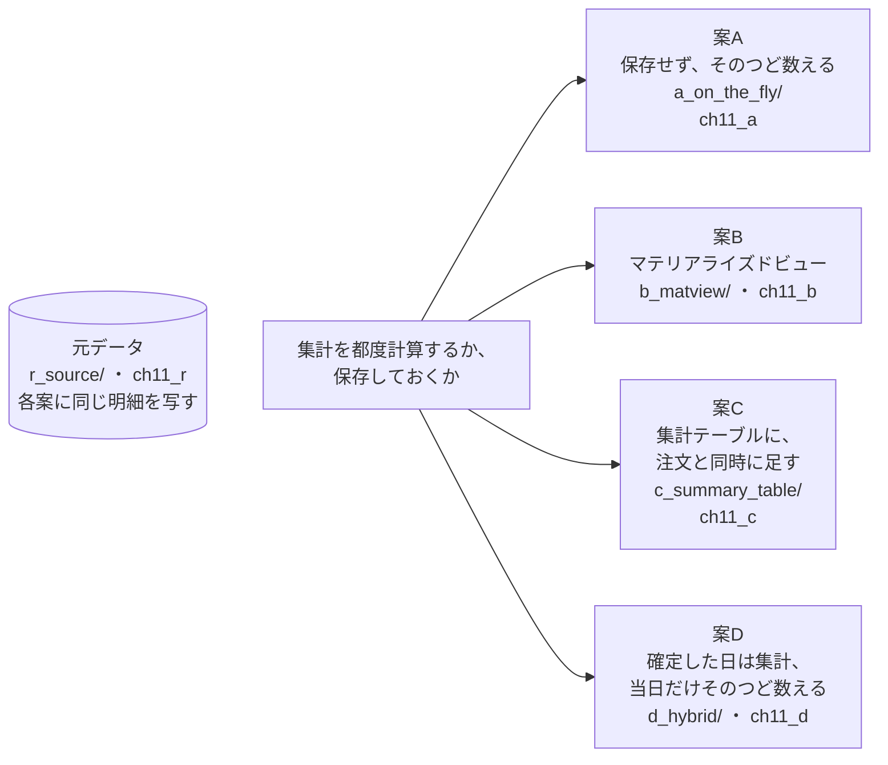
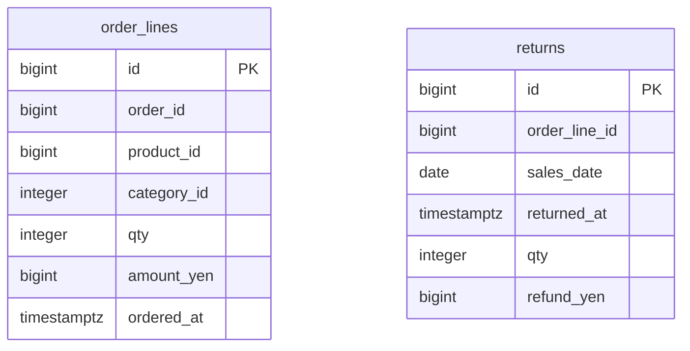
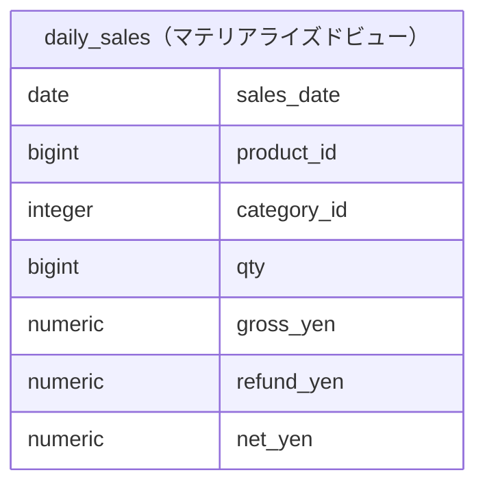
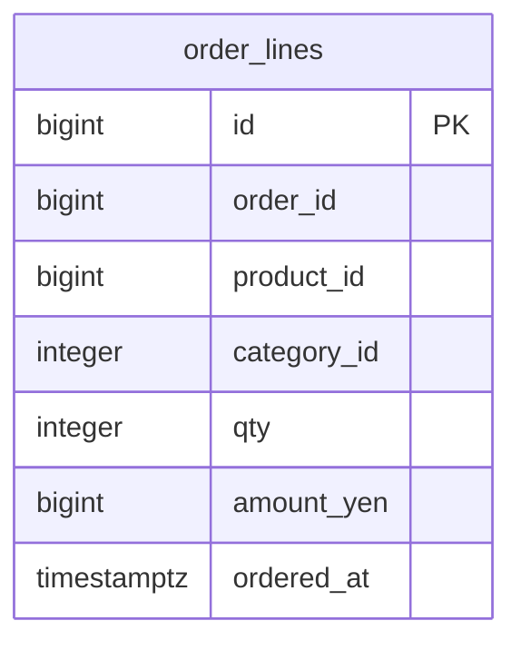
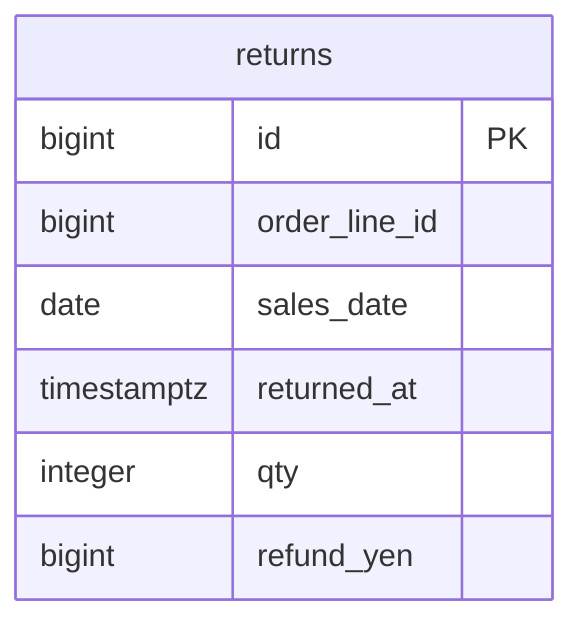
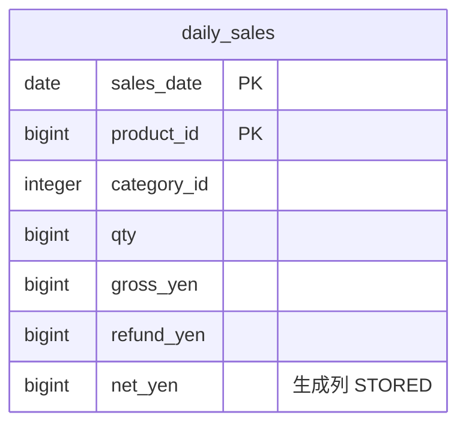
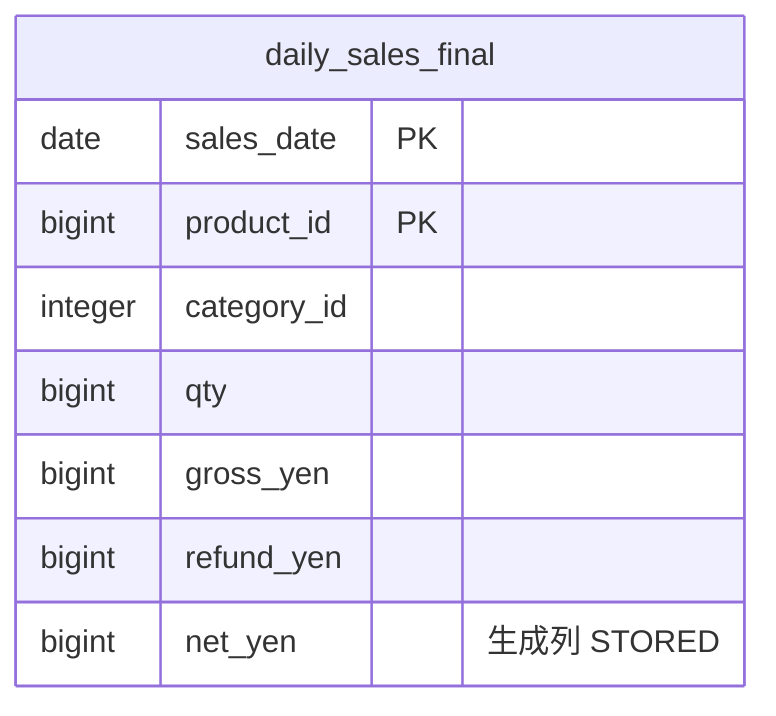

# 第11章 売上ダッシュボード　集計を都度計算するか、保存しておくか

書籍『PostgreSQLで学ぶDB設計の教科書』第11章のサンプルです。

EC サイトの管理画面に日別の売上を出す仕組みを、4 つの案で作って比べます。

## この章で決めること

- 集計を保存するか、そのつど数えるか
- 保存するなら、マテリアライズドビューか、通常のテーブルか
- 集計をいつ更新するか。当日の数字をどう扱うか
- 集計の粒度をどう決めるか

## 設計案の構成図



## 各案のテーブル

### 案A 保存せず、そのつど数える（`ch11_a`）

<!-- ER:ch11_a -->

<!-- /ER -->

### 案B マテリアライズドビュー（`ch11_b`）

マテリアライズドビュー `daily_sales` は、`load.sql` の中で作ります。

<!-- ER:ch11_b -->
テーブルが多く、1 つの図では字が小さくなるので、3 つの図に分けています。外部キーの参照先が別の図にあるときは、列に FK と付いています。






<!-- /ER -->

### 案C 集計テーブルに、注文と同時に足す（`ch11_c`）

<!-- ER:ch11_c -->
テーブルが多く、1 つの図では字が小さくなるので、3 つの図に分けています。外部キーの参照先が別の図にあるときは、列に FK と付いています。




<!-- /ER -->

### 案D 確定した日は集計、当日だけそのつど数える（`ch11_d`）

<!-- ER:ch11_d -->
テーブルが多く、1 つの図では字が小さくなるので、3 つの図に分けています。外部キーの参照先が別の図にあるときは、列に FK と付いています。




<!-- /ER -->

## 動かし方

```bash
# 1. テーブルとデータを作り、読み取り・鮮度・サイズ・変更の手数を取る（既定は S）
bash ch11_sales_dashboard/run_measure.sh

# 2. 集計の行への書き込みの集中を測る（5 回の中央値）
bash ch11_sales_dashboard/run_bench.sh

# やり直すときは、この章のスキーマだけを消す
bash scripts/reset-chapter.sh 11
```

- `bench/` は、集計を持たない基準・1 商品への集中・集計の行を分けた場合・均等な分散の 4 通りです
- `change/10_add_dimension.sql` は、集計に地域の軸をあとから足す手順です
- `queries/90_verify.sql` は、集計が明細から数え直した値と一致することを確かめます

## どの案を選ぶか（書籍の「条件ごとの選び方」の要点）

- まず案A で足りるかを測る（集計を保存する設計は、ズレを直す手間と検査を連れてくる）
- 数分の遅れを許せて、集計を触る経路を 1 つにまとめたいなら案B（`CONCURRENTLY` と、そのための素の一意インデックス）
- 常に最新の数字が要るなら案C（集中する見込みがあるなら、集計の行を分ける）
- 当日だけ最新で、過去は確定でよいなら案D
- 集計の粒度は最初に決める（あとから細かくするのが、この章で最も戻しにくい変更）

## ファイル一覧

先頭のコメントの 1 行目を添えています。

<details>
<summary>開く</summary>

<!-- FILES -->
- `make_refresh_wait.sh` … REFRESH の最中に読み取りがどれだけ待たされるかを測る。
- `run_bench.sh` … 集計行への更新の集中を測る。この章の最重要の測定。
- `run_measure.sh` … 第11章の測定を最初から通しで実行し、results/ に保存する。
- `a_on_the_fly/`
  - `20_read_daily.sql` … 案A: 画面を開くたびに明細から数える。日別の売上 30 日ぶん。
  - `load.sql` … 案A に元データを写す。
  - `schema.sql` … 案A: 集計を保存せず、画面を開くたびに明細から数える。
- `b_matview/`
  - `20_read_daily.sql` … 案B: 日別の売上 30 日ぶん。
  - `20_staleness.sql` … マテリアライズドビューは、元のテーブルを変えても自動では変わらない。
  - `30_refresh_conditions.sql` … REFRESH ... CONCURRENTLY が何を要求するかを、索引の状態を変えて確かめる。
  - `load.sql` … 案B に元データを写し、マテリアライズドビューを作る。
  - `schema.sql` … 案B: マテリアライズドビューに集計を保存し、REFRESH で作り直す。
- `bench/`
  - `hot.sql` … 集計あり・1 商品に集中（人気商品）
  - `hot_sharded.sql` … 集計あり・1 商品に集中・集計行を 16 分割（緩和策）
  - `no_summary.sql` … 集計を更新しない（基準）
  - `spread.sql` … 集計あり・商品が散る（1,000 商品に均等）
- `c_summary_table/`
  - `20_read_daily.sql` … 案C: 日別の売上 30 日ぶん。
  - `30_incremental.sql` … 案C の差分更新。注文を入れると同時に、その日その商品の集計行を書き換える。
  - `40_shard.sql` … 集計行への集中を緩める。集計行を 1 つではなく 16 個に分ける。
  - `50_drift.sql` … 集計テーブルは、元データとズレうる。ズレを検出して直す。
  - `load.sql` … 案C に元データを写し、集計テーブルを作る。
  - `schema.sql` … 案C: 集計テーブルを持ち、注文と同じトランザクションで差分更新する。
- `change/`
  - `10_add_dimension.sql` … 変更シナリオ: 集計の軸を 1 つ足す（地域別）。
- `d_hybrid/`
  - `20_read_daily.sql` … 案D: 日別の売上 30 日ぶん。
  - `load.sql` … 案D に元データを写し、確定した日だけの集計テーブルを作る。
  - `schema.sql` … 案D: 確定した日は集計テーブルから読み、当日だけ明細を都度集計して足す。
- `queries/`
  - `50_sizes.sql` … 4 案が使うテーブルの合計を比べる。
  - `90_verify.sql` … 4 案の集計が、元データから数え直した値と一致することを確かめる。比較の前提である。
- `r_source/`
  - `schema_10_table.sql` … 第11章の元データ。4 案はここから同じ中身を写す。
  - `schema_20_generate.sql` … 注文・明細・返品を生成する。
<!-- /FILES -->

</details>

## results/

採取した出力です。先頭に `bash scripts/collect-env.sh` の出力（版・設定・日時）が付いています。
ファイル名の `_S` は、そのデータ量で取ったことを表します。書籍の図と数値は S です。
