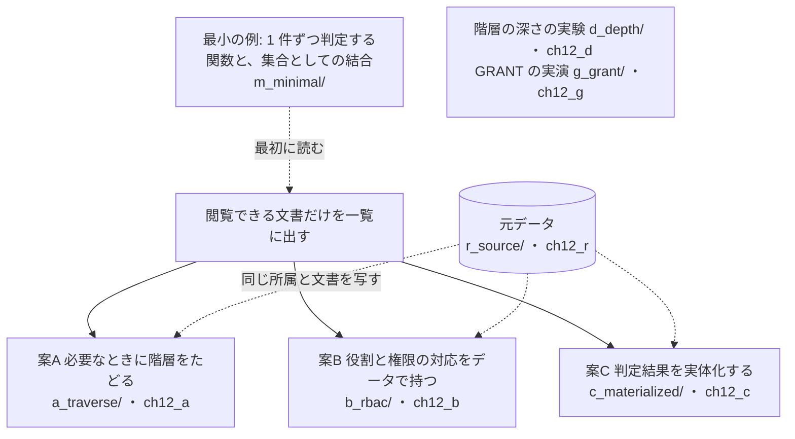
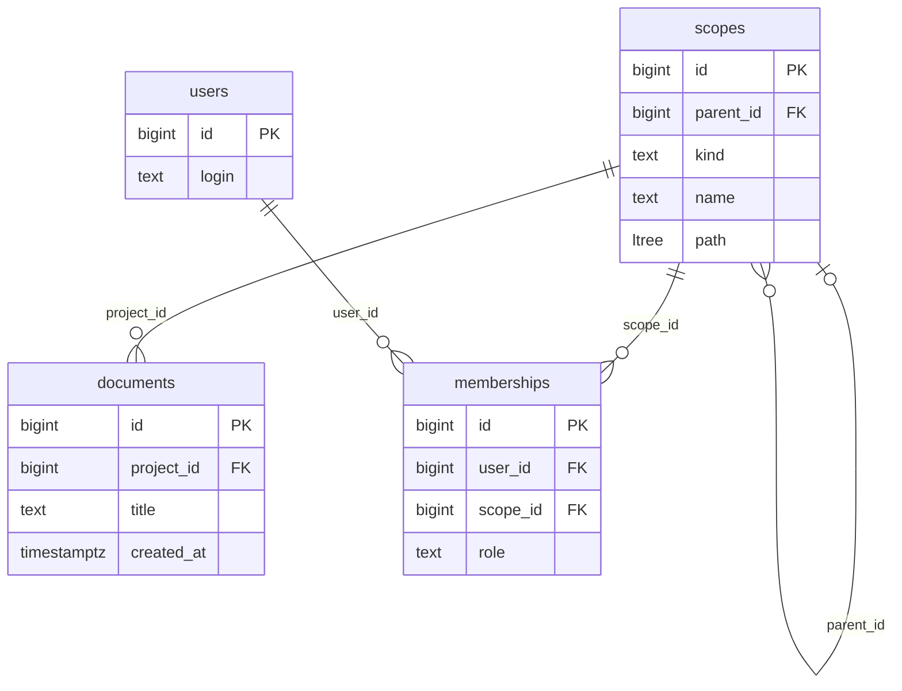
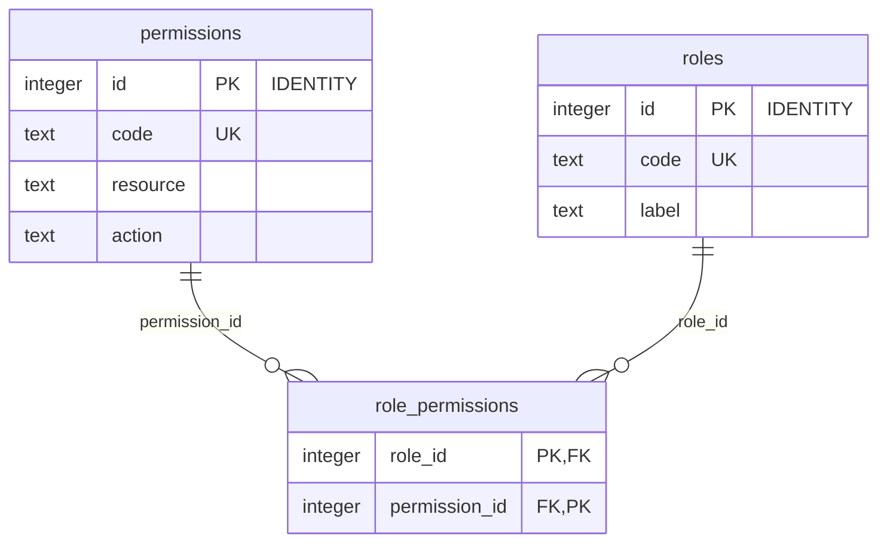
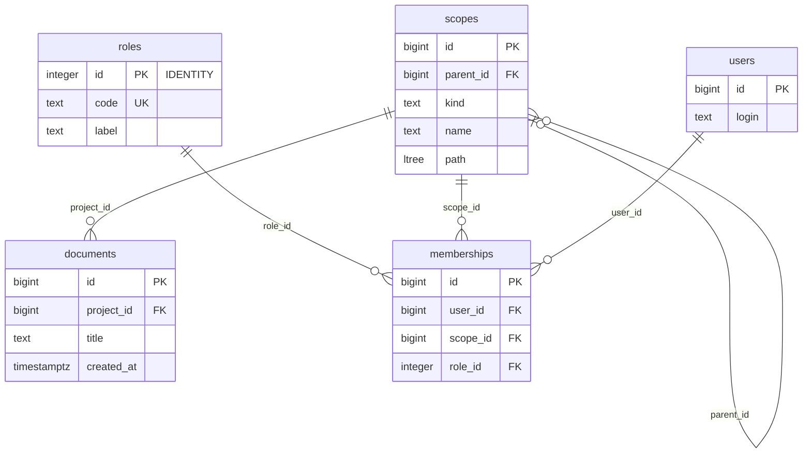
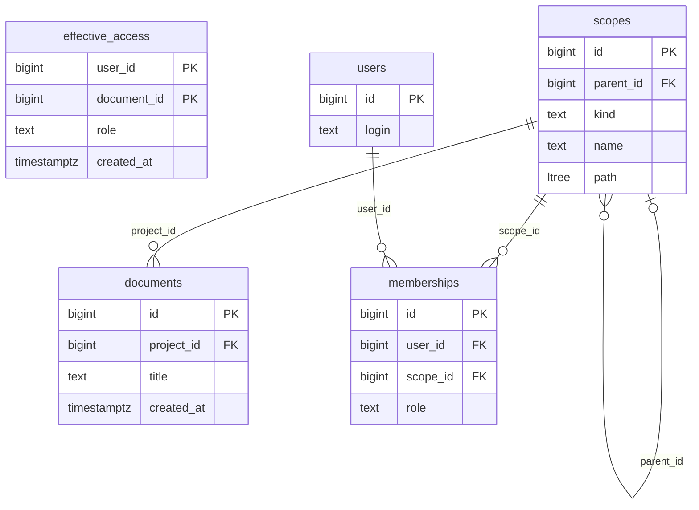

# 第12章 権限　閲覧できる文書だけを一覧に出す

書籍『PostgreSQLで学ぶDB設計の教科書』第12章のサンプルです。

組織・チーム・プロジェクトの階層を持つ社内の文書共有サービスで、利用者が閲覧できる文書だけを一覧に出す仕組みを、3 つの案で比べます。

## この章で決めること

- 閲覧できるかの判定を保存するか、そのつど階層をたどるか
- 階層を再帰の問い合わせでたどるか、経路の列を使うか
- 絞り込みをアプリで書くか、データベースのポリシー（行レベルセキュリティ）に任せるか
- 役割と権限の対応を、コードで持つかデータで持つか

## 案の見取り図



- `m_minimal/10_minimal_demo.sql` は、元データを作らずに単独で流せる最小の例です。この章の問題の形を最初に見るのに使えます

## 各案のテーブル

### 案A 必要なときに階層をたどる（`ch12_a`）

<!-- ER:ch12_a -->

<!-- /ER -->

### 案B 役割と権限の対応をデータで持つ（`ch12_b`）

テーブルが 7 つあるので、2 つの図に分けます。

**役割と権限**

<!-- ER:ch12_b only=roles,permissions,role_permissions -->

<!-- /ER -->

**所属と文書**（`memberships` が、利用者・範囲・役割を結びます）

<!-- ER:ch12_b only=scopes,users,memberships,documents,roles -->

<!-- /ER -->

### 案C 判定結果を実体化する（`ch12_c`）

<!-- ER:ch12_c -->

<!-- /ER -->

## 動かし方

```bash
# 全部を取り直す（既定は S）。案C の初期構築（30 秒以上）とズレの検査（1 回 45 秒以上）があり、全体で 10 分ほど
bash ch12_permission/run_measure.sh

# 1 つずつ流すとき
bash scripts/run-sql.sh book_owner ch12_r ch12_permission/r_source/schema_10_table.sql
SIZE=S bash scripts/run-sql.sh book_owner ch12_r ch12_permission/r_source/schema_20_generate.sql
bash scripts/run-sql.sh book_owner ch12_a ch12_permission/a_traverse/schema.sql
bash scripts/run-sql.sh book_owner ch12_a ch12_permission/a_traverse/load.sql
bash scripts/run-sql.sh book_app   ch12_a ch12_permission/a_traverse/21_read_set.sql

# やり直すときは、この章のスキーマだけを消す
bash scripts/reset-chapter.sh 12
```

注意する点:

- **測定は `book_app`** で行います。スーパーユーザー（`book_admin`）とテーブルの所有者は行レベルセキュリティを迂回するので、
  ポリシーが効いていないのに効いているように見えます
- **権限不足の実演は `book_guest`** で行います。`book_app` には既定の権限が自動で付くので、`g_grant/` のシーケンスの権限不足は再現しません
- **行レベルセキュリティのポリシーは、測定が終わったら外します**（`a_traverse/39_rls_disable.sql`）。
  残すと、次に測る案が「ポリシーが絞ったあとの行」にしか触らず、比較が崩れます
- `*_fails.sql` は失敗するのが正しいファイルです
- `summarize.py` は、`results/` のログから中央値と振れ幅を求めます

## どの案を選ぶか（書籍の「条件ごとの選び方」の要点）

- 全員が入る大きなチームがあるなら、案C を選ばない（判定表の大半がそのチームで埋まる）。案A の集合方式か、ポリシー方式にする
- 所属が完全に静的なら、案C が成り立つ余地がある（利用者数 × 文書数の掛け算を先に見積もる）
- 役割と権限の対応を運営が画面から変えたいなら、案B を足す
- 絞り込みの漏れを 1 か所で止めたいなら、ポリシー方式にする
- 既存のアプリにある 1 件ずつの判定関数は、一覧にはそのまま使わない

## ファイル一覧

先頭のコメントの 1 行目を添えています。

<details>
<summary>開く</summary>

<!-- FILES -->
- `run_measure.sh` … 第12章の測定を最初から通しで実行し、results/ に保存する。
- `summarize.py` … results/ のログから、中央値と幅（(最大-最小)/中央値）を求める。
- `a_traverse/`
  - `20_read_func.sql` … 案A の書き方(1)「1 件ずつ可否を返す関数を WHERE に置く」。
  - `21_read_set.sql` … 案A の書き方(2)「見える範囲を集合として作り、結合する」。
  - `22_read_ltree.sql` … 案A の書き方(3)「階層を ltree の経路で持ち、子孫の判定を 1 つの演算子で書く」。
  - `30_rls_enable.sql` … 案A の判定を、問い合わせではなく**行レベルセキュリティのポリシー**に書く。
  - `31_rls_read.sql` … ポリシーを付けた状態で、素の SELECT を測る。
  - `32_rls_bulk.sql` … ポリシーを付けた表を、一括処理（全件を読む処理）から使うとどうなるか。
  - `39_rls_disable.sql` … ポリシーを外して、案A を元の状態に戻す。
  - `load.sql` … 案A に元データを写す。
  - `schema.sql` … 案A: 判定結果を持たず、必要なときに階層をたどる。
  - `verify_content.sql` … 案A の中身が元データと一致すること。返す全行の先頭列が 0 になる形で書く。
- `b_rbac/`
  - `20_read_list.sql` … 案B の一覧。案A の集合方式（a_traverse/21_read_set.sql）と比べる。
  - `40_time_bounded.sql` … 案B に「期限つきの招待」と「大文字・小文字を区別しないログイン名」を足す。
  - `41_overlap_fails.sql` … 同じ利用者・同じ対象で、期間が**重なる**招待を入れる。
  - `42_collation_fails.sql` … 'Alice' が既に入っている表に 'ALICE' を入れる。
  - `load.sql` … 案B に元データを写す。所属の role（文字列）を roles への参照に置き換える。
  - `schema.sql` … 案B: 役割と権限の対応をデータで持つ（RBAC）。
  - `verify_content.sql` … 案B の中身が元データと一致すること。返す全行の先頭列が 0 になる形で書く。
- `c_materialized/`
  - `15_build.sql` … 案C の判定表を初期構築する。この章で最も大きな数が出る。
  - `20_read_list.sql` … 案C の一覧。階層をたどらず、判定表を user_id で引いて新しい順に 20 件。
  - `50_drift.sql` … 判定表は、元の所属とズレうる。ズレを検出する検査と、その検査が動いていることの確認。
  - `load.sql` … 案C に元データを写す。判定表（effective_access）はまだ作らない。
  - `schema.sql` … 案C: 判定結果を実体化する（effective_access）。
  - `verify_content.sql` … 案C の元データの写しが、元データと一致すること。返す全行の先頭列が 0 になる形で書く。
- `change/`
  - `10_membership_change.sql` … 所属を変えたときの費用を、案A と案C で比べる。
- `compare/`
  - `50_sizes.sql` … 3 案が使うテーブルの合計を比べる。
  - `90_verify.sql` … 3 案（と 4 つの書き方）が、同じ利用者に同じ文書を返すことを確かめる。比較の前提である。
- `d_depth/`
  - `20_depth.sql` … 深さを 2・4・6・8・10・12 と変えて、案A（再帰 CTE）の一覧を測る。
  - `load.sql` … 深さ 12 の鎖を 200 本作る。文書は最深部（lvl = 12）に 10,000 件。
  - `schema.sql` … 階層の深さを変えたときの、案A（再帰 CTE）の時間を測るための専用データ。
- `g_grant/`
  - `10_serial_insert_fails.sql` … serial の列を持つ表に INSERT する。表への INSERT は GRANT されている。
  - `11_identity_insert.sql` … IDENTITY の列を持つ表に INSERT する。GRANT したのは表への INSERT だけで、 serial の場合と権限はまったく同じである。
  - `schema.sql` … データベースのロール（GRANT）と、アプリの権限の切り分け。
- `m_minimal/`
  - `10_minimal_demo.sql` … 「1 件ずつ判定する関数」と「集合として結合する」の差を、最小の形で見る。
- `r_source/`
  - `schema_10_table.sql` … 第12章の元データ。3 案（案A・案B・案C）はここから同じ中身を写す。
  - `schema_20_generate.sql` … 階層・利用者・文書・所属を生成する。
<!-- /FILES -->

</details>

## results/

採取した出力です。先頭に `bash scripts/collect-env.sh` の出力（版・設定・日時）が付いています。
ファイル名の `_S` は、そのデータ量で取ったことを表します。書籍の図と数値は S です。
