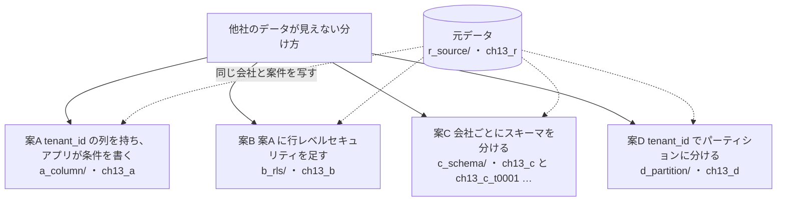
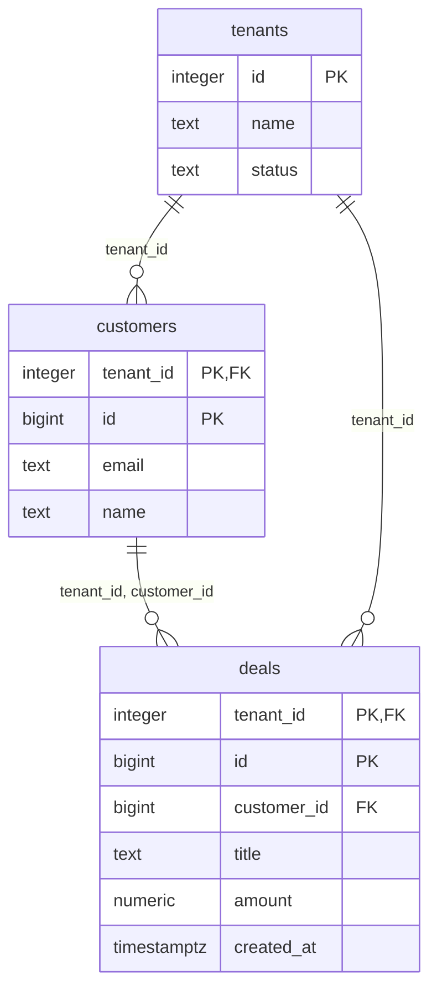
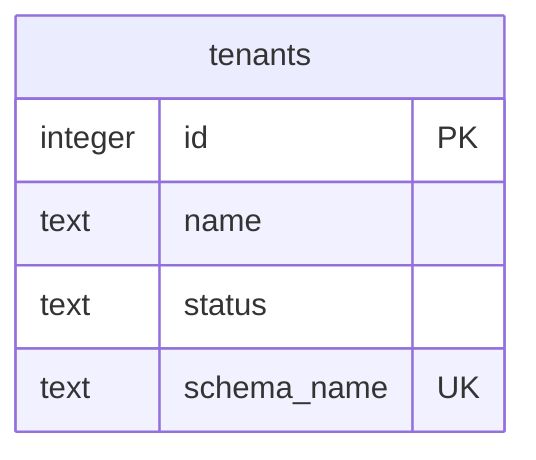
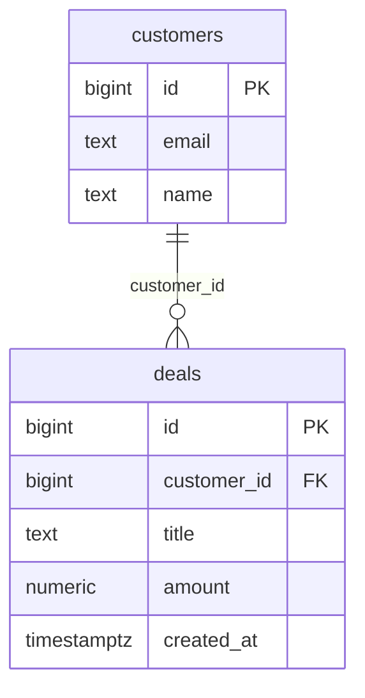
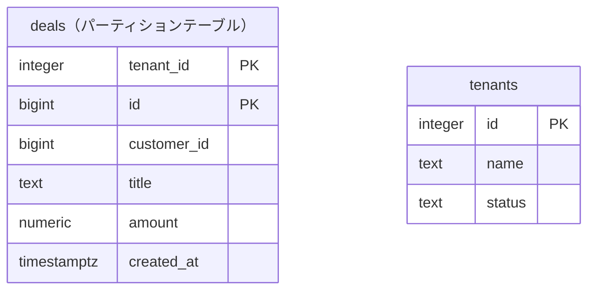

# 第13章 マルチテナント　他社のデータが見えない分け方

書籍『PostgreSQLで学ぶDB設計の教科書』第13章のサンプルです。

複数の会社が同じシステムを使う企業向けの業務システムで、他社のデータが見えない分け方を、4 つの案で比べます。

## この章で決めること

- 会社の区別を、列・スキーマ・パーティションのどれで持つか
- 絞り込みを、アプリが条件を書くか、データベースが強制するか。強制すると遅くなるか
- 会社が 1,000 社・10,000 社に増えたとき、どの分け方が先に限界に当たるか
- 解約した会社のデータを消す時間

## 案の見取り図



## 各案のテーブル

### 案A tenant_id の列を持ち、アプリが条件を書く（`ch13_a`）

<!-- ER:ch13_a -->

<!-- /ER -->

### 案B 案A に行レベルセキュリティを足す（`ch13_b`）

テーブルの形は案A と同じです。違いは、`b_rls/30_policy.sql` で付けるポリシーです。

<!-- ER:ch13_b -->

<!-- /ER -->

### 案C 会社ごとにスキーマを分ける（`ch13_c` と会社ごとのスキーマ）

`ch13_c` には会社の一覧だけを置き、`load.sql` が会社ごとにスキーマ（`ch13_c_t0001` …）を作ります。
どの会社のスキーマも同じ形なので、1 社分を描きます。会社ごとのテーブルには `tenant_id` の列がありません（スキーマが会社を表す）。

<!-- ER:ch13_c -->

<!-- /ER -->

1 社分（`ch13_c_t0001`）:

<!-- ER:ch13_c_t0001 -->

<!-- /ER -->

### 案D tenant_id でパーティションに分ける（`ch13_d`）

`deals` はパーティションテーブルで、大きい 1 社（`deals_t1`）とほかの会社（`deals_rest`）に分けています。

<!-- ER:ch13_d -->

<!-- /ER -->

## 動かし方

```bash
# 全部を取り直す（既定は S）
bash ch13_multi_tenant/run_measure.sh

# やり直すときは、この章のスキーマだけを消す（会社ごとの ch13_c_t* も消える）
bash scripts/reset-chapter.sh 13
```

- **測定は `book_app`** で行います。テーブルの所有者とスーパーユーザーは行レベルセキュリティを迂回します。
  `b_rls/31_owner_bypass.sql` は、`FORCE ROW LEVEL SECURITY` を外すと、テーブルの所有者には絞り込みが効かないことを見せる例です
- `a_column/40_forgotten_where.sql` と `b_rls/40_forgotten_where.sql` は、条件を書き忘れたときに何が返るかの比較です
- `compare/60_dump.sh` は、1 社分のデータを `pg_dump` で抜き出す手間を、案C と案B で比べます
- `change/10_add_column.sql` は全社への列の追加、`change/20_terminate.sql` は解約した会社のデータの消去です
- `*_fails.sql` は失敗するのが正しいファイルです

## どの案を選ぶか（書籍の「条件ごとの選び方」の要点）

- 案A 単独は選ばない（案B の土台にする）
- 会社が数十社までで、今後も大きく増えないなら、案C が成り立つ
- 会社が数百社を超える、または増え方が読めないなら案B（全社への変更が 1 回で済み、原子性が保てる）
- 1 社だけが極端に大きいなら、案B に案D を足す
- 会社ごとのバックアップや引き渡しを求められるなら、案C を検討する

## ファイル一覧

先頭のコメントの 1 行目を添えています。

<details>
<summary>開く</summary>

<!-- FILES -->
- `run_measure.sh` … 第13章の測定を最初から通しで実行し、results/ に保存する。
- `a_column/`
  - `20_read_list.sql` … 案A の一覧。アプリが WHERE tenant_id = ... を書く。
  - `25_cross_tenant.sql` … 運営の管理画面。全社を横断して、期間で集計する。
  - `26_cross_tenant_index.sql` … 横断用のインデックス (created_at) を足して、同じ問い合わせを測り直す。
  - `40_forgotten_where.sql` … 案A で、絞り込みの条件を書き忘れた問い合わせを実行する。
  - `load.sql` … 案A に元データを写す。
  - `schema.sql` … 案A: tenant_id の列を持ち、絞り込みをアプリが書く。
  - `verify_content.sql` … 案A が元データと同じ中身であることを検査する。全行の先頭列が 0 になる。
- `b_rls/`
  - `20_read_list.sql` … 案B の一覧。SQL に WHERE tenant_id は書かない。ポリシーが付ける。
  - `30_policy.sql` … 案B のポリシーを付ける。
  - `31_owner_bypass.sql` … ポリシーを付けた表を、表を作った本人（所有者）で読む。
  - `40_forgotten_where.sql` … 案B で、同じ「条件を書き忘れた問い合わせ」を実行する。
  - `41_pool_leak.sql` … ポリシーを正しく設定していても、設定の寿命を間違えると他社の行が見える。
  - `42_unique_setup.sql` … 一意制約からの情報漏れを再現するための準備。
  - `43_covert_channel_fails.sql` … 見えない行の存在が、一意制約のエラーから分かる。
  - `load.sql` … 案B に元データを写す。案A と同じ順・同じインデックスにする。
  - `schema.sql` … 案B: 案A と同じ形に、行レベルセキュリティのポリシーを足す。
- `c_schema/`
  - `50_migration_atomicity_fails.sql` … 案C では、全社への変更を 1 つのトランザクションで実行できない。
  - `load.sql` … 案C に会社ごとのスキーマを作り、元データを写す。
  - `schema.sql` … 案C: 会社ごとにスキーマを分ける。
- `change/`
  - `10_add_column.sql` … 全社に列を 1 つ足す。案B は 1 回、案C はテナントの数だけ実行する。
  - `20_terminate.sql` … テナント 1 社の解約。小さい会社（51）と大きい会社（1）の両方で測る。
- `compare/`
  - `50_sizes.sql` … 4 案のサイズと、カタログの大きさを比べる。
  - `60_dump.sh` … 会社 1 社ぶんだけを取り出せるかを、案C と案B で比べる。
  - `90_verify.sql` … 4 案が同じ中身を持つことを検査する。全行の先頭列が 0 になる。
- `d_partition/`
  - `30_not_valid_fk.sql` … パーティションに分けた表に、あとから外部キーを足す。
  - `load.sql` … 案D に元データを写す。案A・案B と同じ順・同じインデックス。
  - `schema.sql` … 案D: 案B と同じ形に、tenant_id でのパーティション分けを足す。
- `r_source/`
  - `schema_10_table.sql` … 第13章の元データ。4 案（案A・案B・案C・案D）はここから同じ中身を写す。
  - `schema_20_generate.sql` … 第13章の元データを作る。SIZE=S / M で行数を変える。
<!-- /FILES -->

</details>

## results/

採取した出力です。先頭に `bash scripts/collect-env.sh` の出力（版・設定・日時）が付いています。
ファイル名の `_S` は、そのデータ量で取ったことを表します。書籍の図と数値は S です。
