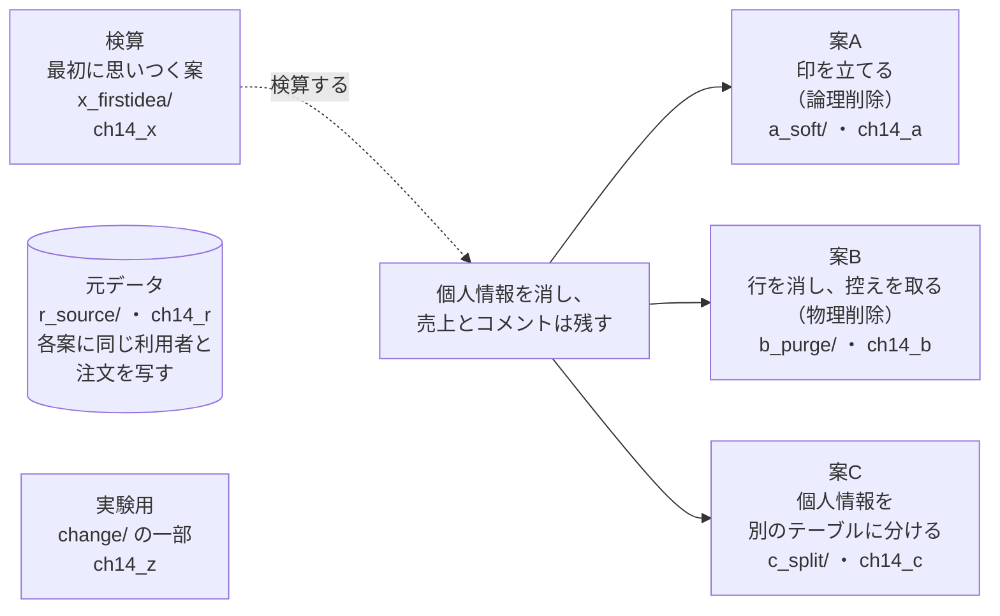
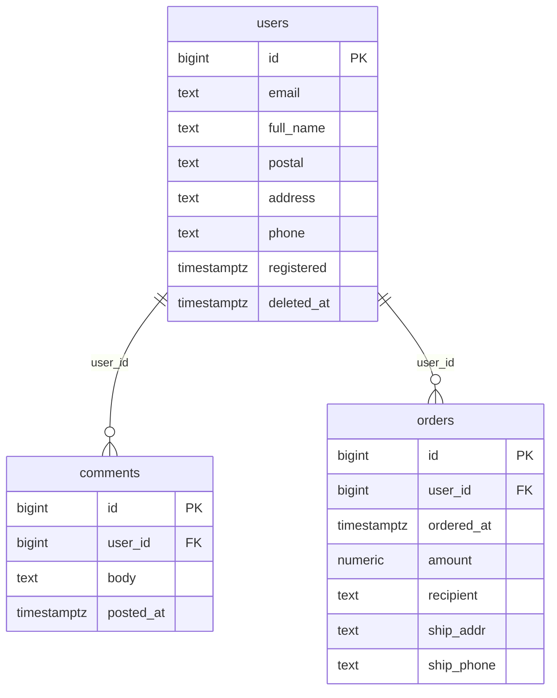
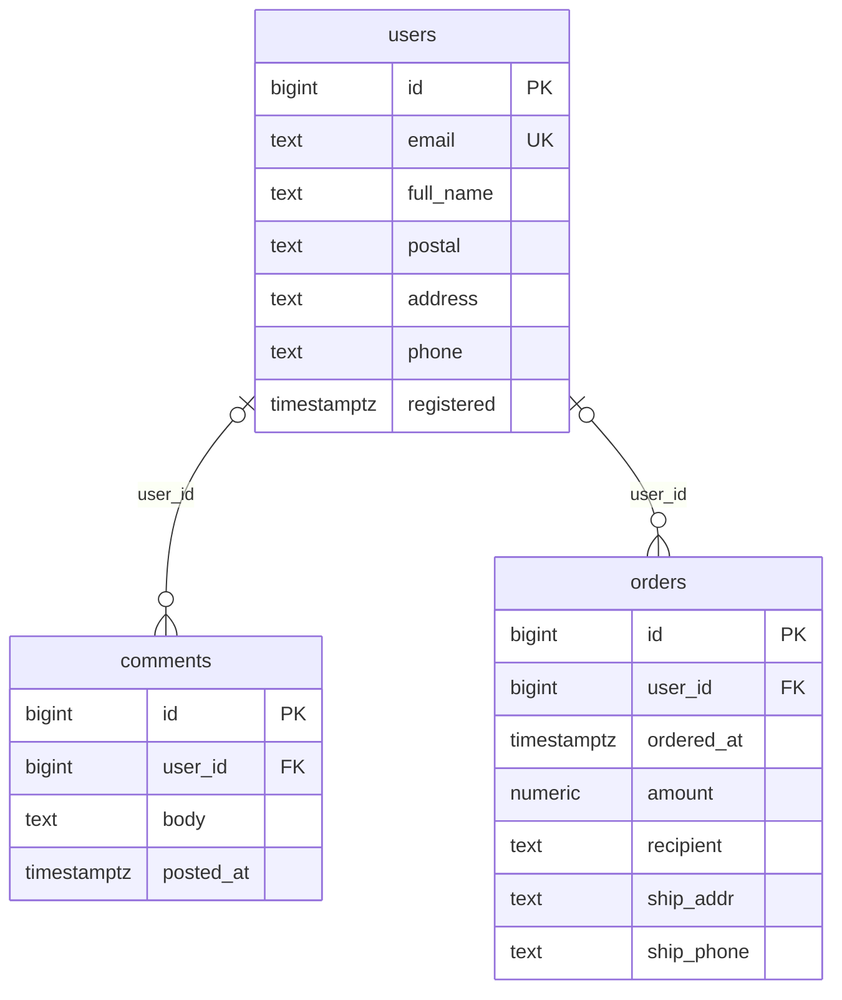
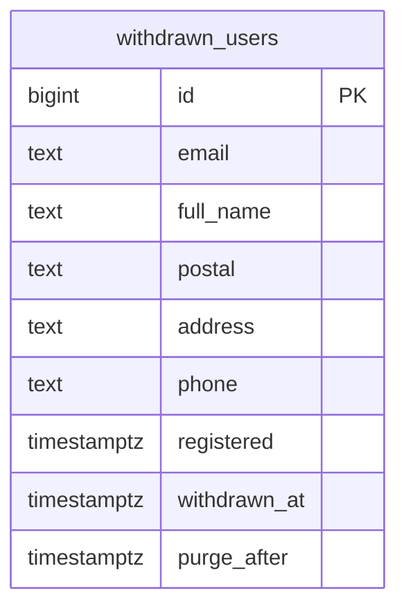
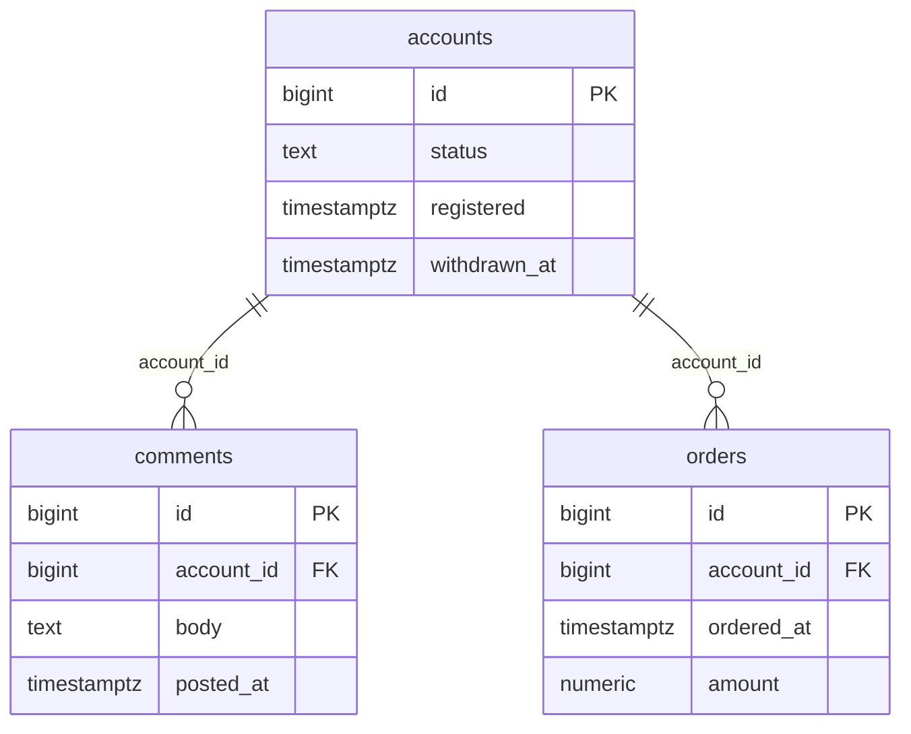
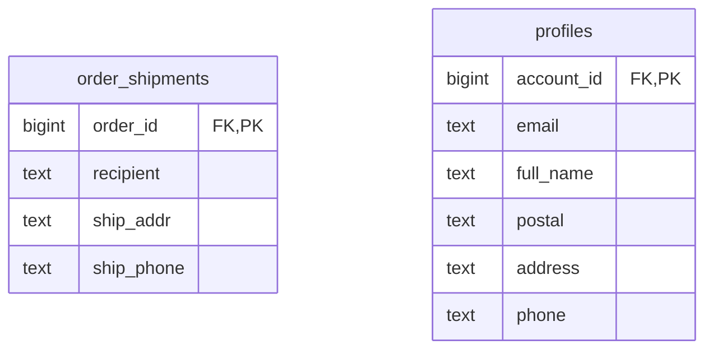

# 第14章 退会とデータ削除　個人情報を消し、売上とコメントは残す

書籍『PostgreSQLで学ぶDB設計の教科書』第14章のサンプルです。

会員制のネットショップで、退会した利用者の個人情報を消し、過去の売上と掲示板のコメントは残す方法を、3 つの案で比べます。

## この章で決めること

- 個人情報を、利用者の行に置くか、別のテーブルに分けるか
- 退会を、印を立てる（論理削除）で表すか、行を消す（物理削除）で表すか
- 30 日以内に戻せることと、同じメールアドレスで再登録できることを、両立できるか
- 消したあと、テーブルはいつ小さくなるか

## 設計案の構成図



- `x_firstidea/` の 3 つのファイルは、どれも失敗するのが正しい検算です

## 各案のテーブル

### 案A 印を立てる（`ch14_a`）

<!-- ER:ch14_a -->

<!-- /ER -->

### 案B 行を消し、控えを取る（`ch14_b`）

<!-- ER:ch14_b -->
テーブルが多く、1 つの図では字が小さくなるので、2 つの図に分けています。外部キーの参照先が別の図にあるときは、列に FK と付いています。




<!-- /ER -->

### 案C 個人情報を別のテーブルに分ける（`ch14_c`）

<!-- ER:ch14_c -->
テーブルが多く、1 つの図では字が小さくなるので、2 つの図に分けています。外部キーの参照先が別の図にあるときは、列に FK と付いています。




<!-- /ER -->

## 動かし方

```bash
# 全部を取り直す（書籍の数値は S。XS は動作確認用で、数値は書籍に使っていない）
SIZE=S bash ch14_account_deletion/run_measure.sh
SIZE=XS bash ch14_account_deletion/run_measure.sh

# 1 つだけ流すとき
bash scripts/run-sql.sh book_owner ch14_a ch14_account_deletion/a_soft/schema.sql

# やり直すときは、この章のスキーマだけを消す
bash scripts/reset-chapter.sh 14
```

- 各案の `20_pii_leftover.sql` は、退会したあとに個人情報が残っている行を数えます
- `change/70_split_pii_a_to_c.sql` は、案A から案C へ個人情報を切り出す移行です。`BEGIN` … `ROLLBACK` で囲んであり、案A のテーブルを変えません
- `change/50_*_fails.sql`・`60_*_fails.sql` は、期間つき外部キーに `ON DELETE CASCADE`・`SET NULL` を付けられないことを確かめます

## どの案を選ぶか（書籍の「条件ごとの選び方」の要点）

- 個人情報の削除が要件の中心なら案C（退会の処理が「行を消す」だけになり、個人情報の列が増えても処理が古びない）
- 退会が「アカウントの無効化」で、個人情報を消す要件が無いなら案A
- 復元の要件が強く、個人情報まで完全に戻す必要があるなら案B（退会から 30 日は同じメールアドレスでの再登録を断り、控えを消す処理も同時に作る）
- 配送先や請求先の写しがあるなら、どの案でも別のテーブルに分ける

## ファイル一覧

先頭のコメントの 1 行目を添えています。

<details>
<summary>開く</summary>

<!-- FILES -->
- `run_measure.sh` … 第14章の測定を最初から通しで実行し、results/ に保存する。
- `a_soft/`
  - `20_pii_leftover.sql` … 案A で、退会した利用者の個人情報がどこに残っているかを数える。
  - `30_active_list.sql` … 案A: 退会していない利用者を登録の新しい順に 20 件。部分インデックスで引く。
  - `40_withdraw.sql` … 案A の退会: 印を立てるだけ。1 文で済む。
  - `load.sql` … 案A に元データを写す。
  - `schema.sql` … 案A: 論理削除。個人情報を利用者の行に置いたまま、deleted_at で印を付ける。
- `b_purge/`
  - `20_pii_leftover.sql` … 案B で、退会した利用者の個人情報がどこに残っているかを数える。
  - `30_active_list.sql` … 案B: 退会した利用者は users に居ないので、条件そのものが要らない。
  - `40_withdraw.sql` … 案B の退会: 控えに写してから行を消す。ON DELETE SET NULL で子の参照が切れる。
  - `load.sql` … 案B に元データを写す。
  - `schema.sql` … 案B: 物理削除 + アーカイブ。
- `c_split/`
  - `20_pii_leftover.sql` … 案C で、退会した利用者の個人情報がどこに残っているかを数える。
  - `30_active_list.sql` … 案C: 本体は残るので、案A と同じく条件で絞る。部分インデックスで引く。
  - `40_withdraw.sql` … 案C の退会: 個人情報のテーブルから行を消し、本体に印を立てる。
  - `load.sql` … 案C に元データを写す。
  - `schema.sql` … 案C: 個人情報を別のテーブルに分ける。退会したらその行だけを消す。
- `change/`
  - `10_add_pii_column.sql` … 変更シナリオ「個人情報の列を 1 つ足す（生年月日）」。
  - `15_index_size_by_ratio.sql` … 削除済みの割合ごとに、全体インデックスと部分インデックスのサイズを比べる。
  - `20_vacuum_after_purge.sql` … 大量の物理削除のあと、テーブルはいつ小さくなるか。
  - `30_validate_lock.sql` … 動いているテーブルに NOT NULL を足す。NOT VALID で全行の確認を後回しにする。
  - `40_fk_index_delete.sql` … 子の外部キー列に索引が無いと、親 1 行の削除で子を全件走査する。
  - `50_period_fk_cascade_fails.sql` … 期間つき外部キー（第8章の WITHOUT OVERLAPS）に、退会の連鎖 ON DELETE CASCADE を付ける。
  - `60_period_fk_set_null_fails.sql` … 同じ期間つき外部キーに ON DELETE SET NULL を付ける。CASCADE と同じエラー文で拒否される。
  - `70_split_pii_a_to_c.sql` … 変更シナリオ: 案A の users と orders から、個人情報を別のテーブルに切り出す（案A → 案C）。
- `compare/`
  - `50_sizes.sql` … 3 案のサイズ。個人情報を分けると表が増えるので、合計で比べる。
  - `90_verify.sql` … 3 案の中身が一致していることの検査。
- `r_source/`
  - `schema_10_table.sql` … 第14章の元データ。3 案（案A・案B・案C）はここから同じ中身を写す。
  - `schema_20_generate.sql` … 第14章の元データを作る。SIZE=XS / S / M で行数を変える。
- `x_firstidea/`
  - `10_haiku_ddl_fails.sql` … 採取した案（haiku）の DDL をそのまま実行する。
  - `20_plain_unique_fails.sql` … 構文を直して通常の UNIQUE(email) にすると作れる。しかし、退会したあとに同じメールで再登録できない（一意制約は退会した行も見続ける）。
  - `30_restore_collision_fails.sql` … この章の入口。「同じメールで再登録できる」と「30日以内なら戻せる」は両方をメールの一意で実現しようとすると衝突する。
<!-- /FILES -->

</details>

## results/

採取した出力です。先頭に `bash scripts/collect-env.sh` の出力（版・設定・日時）が付いています。
ファイル名の `_S`・`_XS` は、そのデータ量で取ったことを表します。書籍の図と数値は S です。
