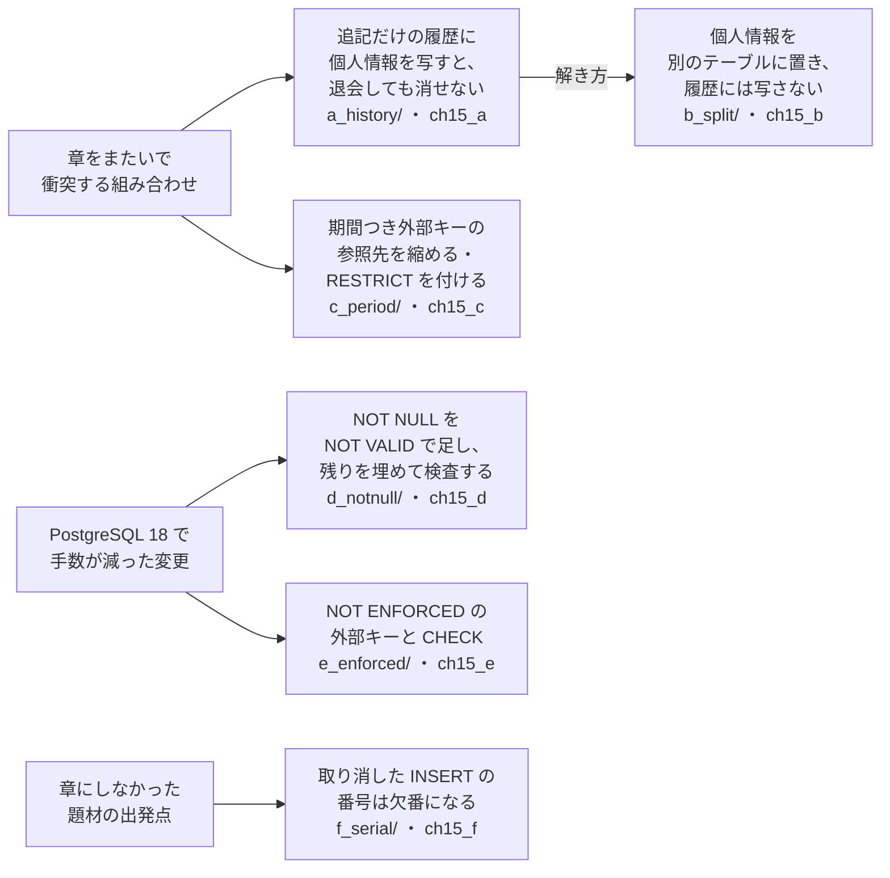
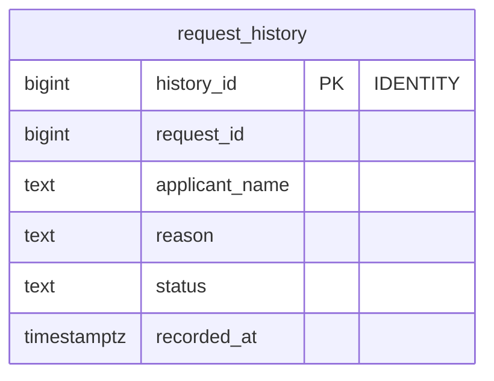
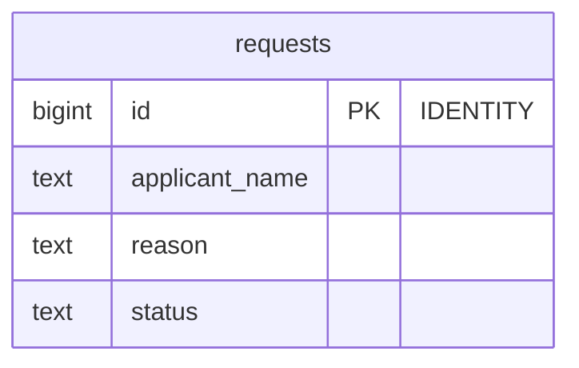
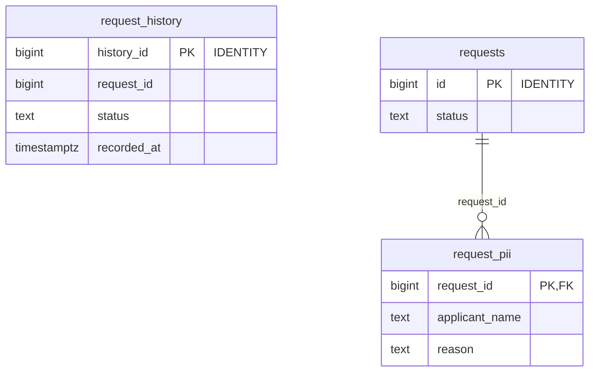
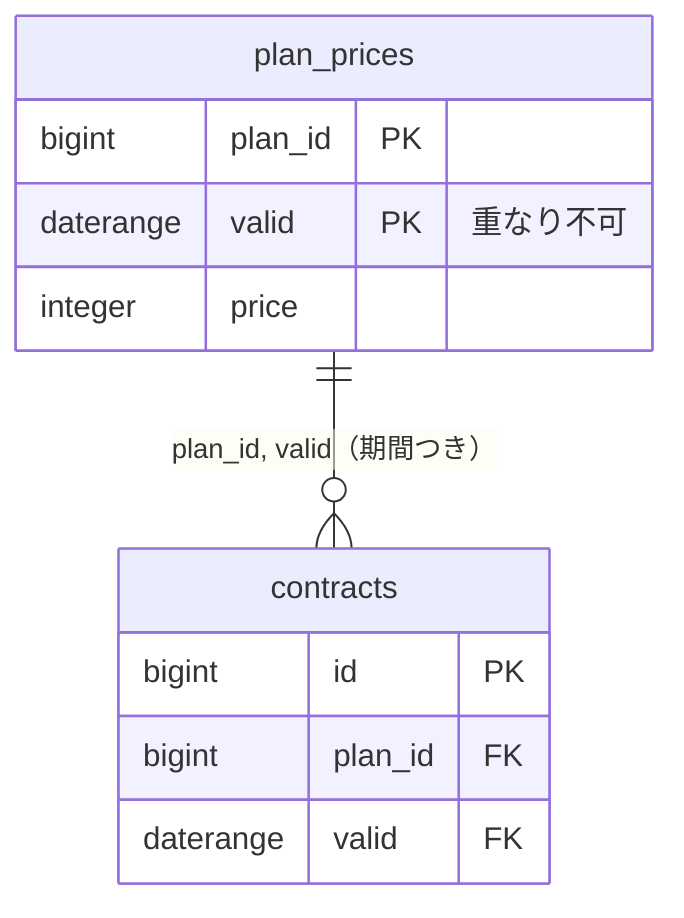
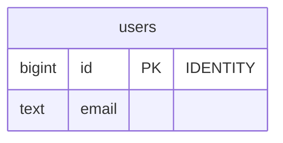
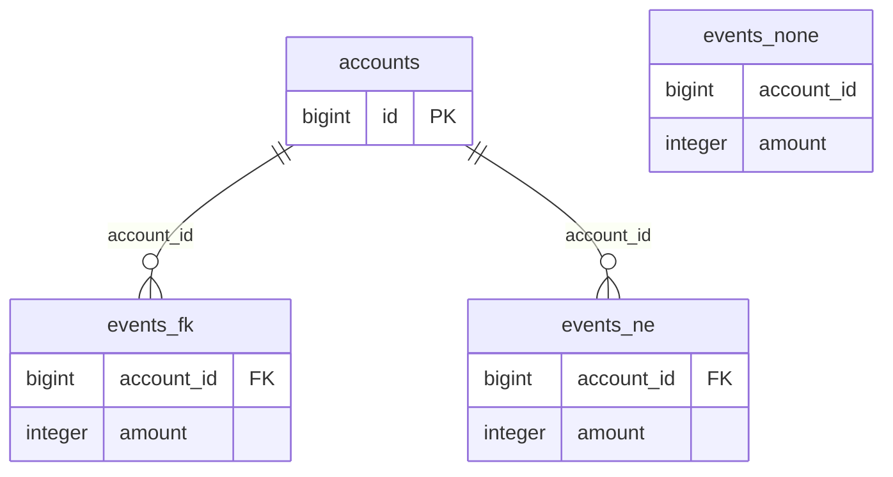
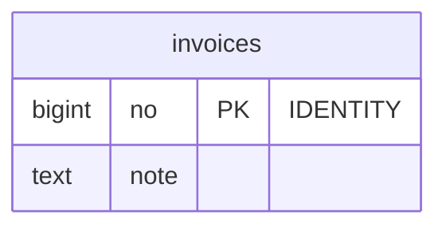

# 第15章 自分の題材に当てはめる　案を立て、測り、選び、説明する

書籍『PostgreSQLで学ぶDB設計の教科書』第15章のサンプルです。

この章は案どうしを比べる章ではありません。章をまたいで衝突する組み合わせと、PostgreSQL 18 で手数が減った変更の実行例を、例ごとにスキーマを分けて置いています。

## 例の構成図



## 各例のテーブル

### 追記だけの履歴に個人情報を写す（`ch15_a`）

<!-- ER:ch15_a -->
テーブルが多く、1 つの図では字が小さくなるので、2 つの図に分けています。外部キーの参照先が別の図にあるときは、列に FK と付いています。




<!-- /ER -->

### 個人情報を別のテーブルに置く（`ch15_b`）

<!-- ER:ch15_b -->

<!-- /ER -->

### 期間つき外部キー（`ch15_c`）

<!-- ER:ch15_c -->

<!-- /ER -->

### NOT NULL を NOT VALID で足す（`ch15_d`）

<!-- ER:ch15_d -->

<!-- /ER -->

### NOT ENFORCED の制約（`ch15_e`）

同じ形のテーブルを 3 つ作り、外部キーの置き方（なし・あり・`NOT ENFORCED`）だけを変えて一括挿入の時間を比べます。

<!-- ER:ch15_e -->

<!-- /ER -->

### 欠番のない連番（`ch15_f`）

<!-- ER:ch15_f -->

<!-- /ER -->

## 動かし方

```bash
# 全部を通しで流す（データ量は固定で、SIZE は使わない）
bash ch15_apply_to_your_own/run_measure.sh

# やり直すときは、この章のスキーマだけを消す
bash scripts/reset-chapter.sh 15
```

- 各例のファイルは、番号の順に流します（`d_notnull/` なら `10_add_not_valid.sql` から `60_find_nulls_after.sql` まで）
- `*_fails.sql` は失敗するのが正しいファイルです（`run_measure.sh` は、失敗しなかったとき、または期待と違う理由で失敗したときに止まります）
- `c_period/40_delete_child_first.sql` や `e_enforced/70_enforce_locks.sql` のように `ROLLBACK` で終わるファイルは、テーブルを変えません

## ファイル一覧

先頭のコメントの 1 行目を添えています。

<details>
<summary>開く</summary>

<!-- FILES -->
- `run_measure.sh` … 第15章の実行例を最初から通しで実行し、results/ に保存する。
- `a_history/`
  - `20_withdraw.sql` … 申請者が退会した。本体の個人情報を消す。
  - `30_erase_history_fails.sql` … 履歴に写した個人情報も消そうとする。トリガーがエラーを返す。
  - `40_pii_left.sql` … 退会した申請者の個人情報が、どこに何行残っているか
  - `load.sql` … 申請を 1 件作り、状態を 2 回変える。変える前の行を履歴に写す。
  - `schema.sql` … 衝突1: 第9章の「追記のみの履歴」と、第14章の「退会したら個人情報を消す」を 1 つのサービスに並べる。
- `b_split/`
  - `20_withdraw.sql` … 退会したら、個人情報のテーブルから行を消す。履歴には触れない
  - `load.sql`
  - `schema.sql` … 衝突1の解き方: 個人情報を別のテーブルに置き（第14章の案C）、履歴には写さない。
  - `verify_pii.sql` … 退会した申請者の個人情報が残っている行数（0 であること）と、履歴の行数
- `c_period/`
  - `20_shrink_fails.sql` … 1 月からの版の期間を、5 月までに縮める（料金表の手直し）。
  - `30_restrict_fails.sql` … 参照先を消せないようにする RESTRICT も、期間つき外部キーには付けられない。
  - `40_delete_child_first.sql` … 料金の版を消すには、同じトランザクションで、参照している契約を先に消す。
  - `load.sql`
  - `schema.sql` … 衝突3: 料金の版を期間で持ち（第8章）、契約が期間つき外部キーで版を参照する。
- `d_notnull/`
  - `10_add_not_valid.sql` … 既存の行を検査せずに、NOT NULL を足す（18 から）
  - `20_insert_null_fails.sql` … 足した直後から、新しい NULL は拒否される
  - `30_validate_fails.sql` … 古い NULL が残っているあいだは、検査を通せない
  - `40_find_nulls.sql` … 残っている NULL を探す。検査を済ませていない制約は、計画を省略する根拠に使われない
  - `50_fill_and_validate.sql` … 残った行を埋めてから、検査を通す
  - `60_find_nulls_after.sql` … 検査が済むと、同じ問い合わせはテーブルを読まずに 0 行を返す
  - `load.sql` … 10 万行のうち 100 行に 1 行、メールアドレスが入っていない
  - `schema.sql` … 18 で手数が減った変更: NULL が残っている列に、あとから NOT NULL を足す。
- `e_enforced/`
  - `20_bulk_insert.sql` … 100 万行を一括で入れる。3 つの表を交互に 5 回ずつ入れ、Time の中央値で比べる
  - `30_accepts_violation.sql` … NOT ENFORCED の制約は、違反する行も受け入れる
  - `40_fk_enforce_fails.sql` … 外部キーは ENFORCED に戻せる。そのとき既存の全行を検査するので、違反が残っていれば失敗する
  - `50_check_enforce_fails.sql` … CHECK 制約は、違反の有無にかかわらず ENFORCED に戻せない（作り直すしかない）
  - `60_fk_enforce.sql` … 違反を消してから、外部キーを ENFORCED に戻す。100 万行を検査する時間を測る
  - `70_enforce_locks.sql` … ENFORCED に戻す ALTER が取るロックを、トランザクションの中で見る。
  - `load.sql`
  - `schema.sql` … 宣言だけして、データベースは検査しない（NOT ENFORCED、18 から）
- `f_serial/`
  - `20_gap.sql`
  - `load.sql`
  - `schema.sql` … 本書が章にしなかった題材の出発点: 欠番のない連番（請求書番号など）
<!-- /FILES -->

</details>

## results/

採取した出力です。先頭に `bash scripts/collect-env.sh` の出力（版・設定・日時）が付いています。
一括挿入の時間（`enforced.txt`）は著者の環境の値で、マシンによって変わります。比べるときは、外部キーの置き方どうしの比を見てください。
